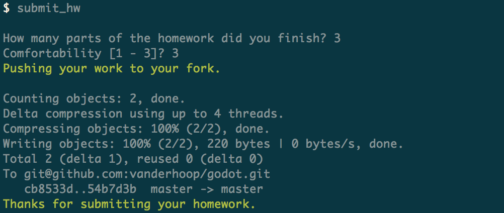

## Homework Submission Process

### Step 1: Add, Commit, and Push Your Work
Once you have completed your homework, head into the root directory of your class repo and stage the files via `git add .`

```bash
cd ~/dev/wdi/godot/
git add .
```
__Note:__ The dot in `git add .` stands for the current directory, meaning the entirety of the directory will be staged, including any and all subdirectories. The `git add .` command is a convenient catch-all which you'll use all the time.

Once the files are staged, make a commit with a message in the present tense that describes what the commit accomplishes/fixes/deletes.

```bash
git commit -m "adds comments to homework solution"
```

### Step 2: Use submit_hw to Create a Pull Request to the Class's God Repo

To submit your homework, you will use a custom command called `submit_hw`, which will prompt you for `Completeness` and `Comfortability` ratings, which you'll enter as integers.



__NOTE:__ If it tells you that you already have a pull request open, fear not. It just means the instructors have yet to accept the previous day's pull request, and all code pushed to your fork will be adopted into the open pull request, so you're golden.

### Further Reading: what does submit_hw do?

When we set up your repos, we had you create what's called a GitHub __fork__, which is a personal remote copy of the class repo for you to do what you wish to it (because we can't have you changing the master repo willy nilly). But because your fork is your personal copy, the instructors have no way of knowing that you've done your work.

So the `submit_hw` command creates what's called a pull request. A __pull request__ allows you to ask another GitHub user to adopt or 'pull' the changes you've made to your forked repo into the original repo.

In doing so, submit_hw formats your pull-request message into an easily digested data format called JSON, with fields for 'completeness' and 'comfortability'. This formatted data allows us to easily track your comfort and progress during the course, and target you for help if necessary.
