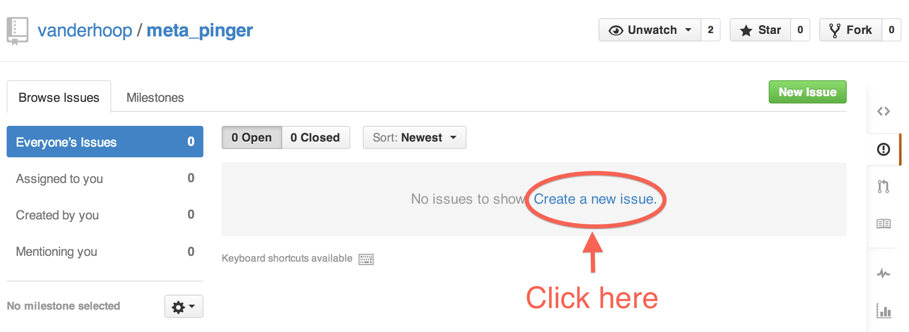
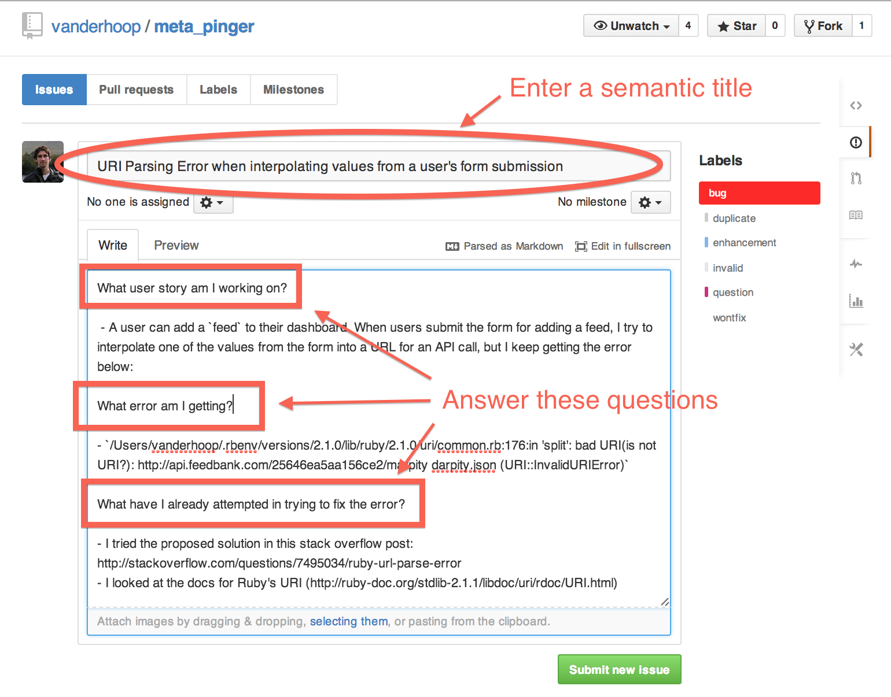
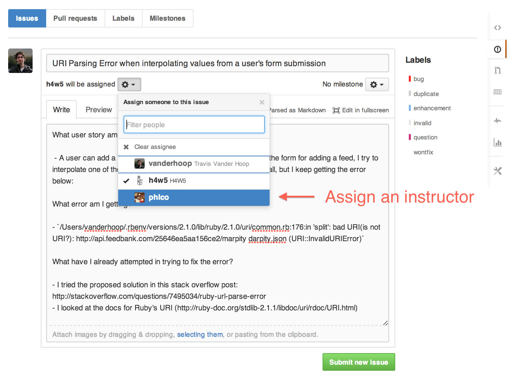
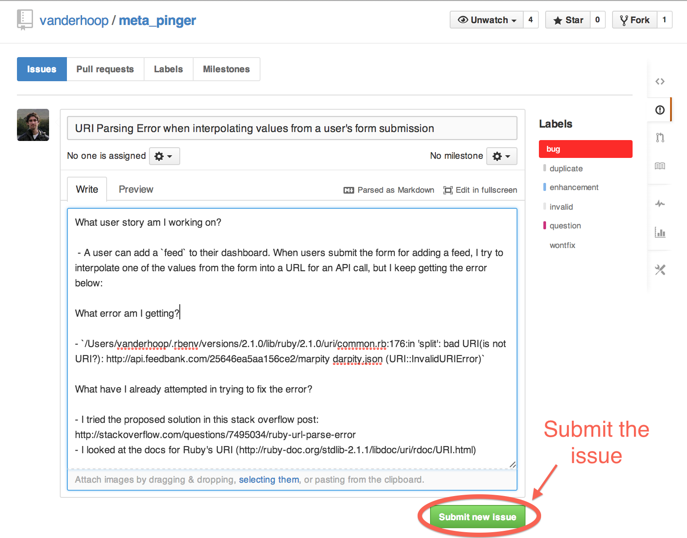

## GitHub Issues Submission

You will be submitting any requests for project help via GitHub issues. 
In doing so, it is vital that you answer these three questions, so that the developer community can effectively onboard themselves to your application:

1. What User Story are you working on?
1. What error are you getting?
1. What have you attempted to fix your error?

___
###Step 1 - Click 'Issues' Within Your Project Repo

___
###Step 2 - Click 'Create a new issue'

___

###Step 3 - Tell us what you're working on, what error you're getting, and what you've done in your attempt to solve it.

Include enough information that it's possible to reproduce the error.  Include links to any research you've done to tackle the issue.

___

###Step 4 - Assign an Instructor to the Issue

___

###Step 5 - Submit the Issue

