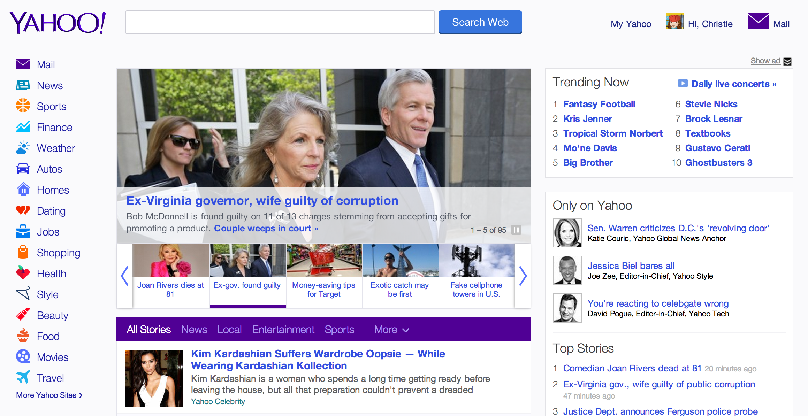

# Dashboard

A dashboard aggregates information for a user from a number of sources. The application offers a list of sources (known as *feeds*), and allows users to choose which feeds to receive, as well as personalize those feeds by (among other things) location and topic.

### Necessary for MVP

- **Resources**: `profile` (singular!), `feeds`
- **User Story Frames**:
  - **(1) SHOW:** A user can show (ie, see) their `profile`... (`/profile`)
  - A user can see a raw `feed` by visiting the feed at its **show** page... (`/feeds/feed-id`)
  - A user can click on a given item to visit the original resource (be it a tweet, an article, etc.)...
  - A user can see a list of pre-built feeds to choose from including (but not limited to): their Twitter feed, their local weather, and popular news stories from the NY Times, on their `profile` **edit** page...
  - A user can add a `feed` to their profile **show** page...
  - A user can page through the history of a feed, but only ten items at a time... (`/feeds/feed-id?page=1`)
- **Required technologies or features**:
  - A user has access to feeds, including but not limited to:
    - [Twitter](https://dev.twitter.com/docs/api) -- **note:** it is useful to use the [Twitter Gem](https://github.com/sferik/twitter)
    - [Weather Underground API](http://www.wunderground.com/weather/api/)
    - [New York Times](http://developer.nytimes.com/docs/most_popular_api/)

### Bonus

- **Resources**: `profiles` (plural!)
- **Data Model**:
  - A `profile` has many `feeds`, and a `feed` belongs to a `profile`.
    - This means that instead of a single `profile`, our app will allow many users, each with their own `profile`, a big change to our user experience!
- **User Story Frames**:
  - When a user signs in via OAuth, a `profile` is created for them if none exists...
  - A user should be able to visit and edit their own profile (`/profiles/profile-id`, `/profiles/profile-id/edit`)
  - A user can add new feeds by adding an **RSS URL**...
  - A user can constrain a feed by associating keywords or tags with the feed...
- **Technologies or Features**:
  - A user can store data relevant to their account (`profile`). That means that Redis will need to have a `profile` resource, and connect it to the OAuth activity in a meaningful way to persist data about an authenticated user!
- **Consumed APIs**:
  - A user has access to feeds, including but not limited to:
    - [Instagram](http://instagram.com/developer/) via OAuth
    - [Tumblr](http://www.tumblr.com/docs/en/api/v2) via OAuth
  - **User authentication (using one or both of the below providers)**: A user can authenticate (sign in) to the micro blog via an OAuth provider...
    - [Facebook](https://developers.facebook.com/docs/facebook-login/manually-build-a-login-flow/v2.1)
    - [Google](https://developers.google.com/accounts/docs/OAuth2WebServer)

### Examples

- Personalized homepages, like [Yahoo](https://www.yahoo.com/) or [Symbaloo](http://www.symbaloo.com/home).
- Interest aggregators like [Pinterest](http://www.pinterest.com/all/food_drink/).
- Readers and feed aggregators like [Feedly](https://feedly.com/index.html#welcome).
