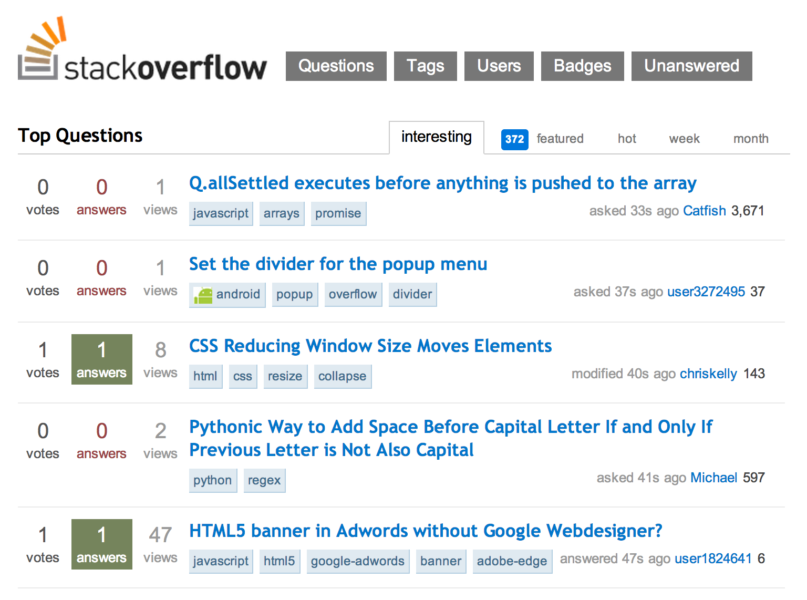

# Forum

A forum is an application that allows users to discuss particular topics. Examples of popular forum topics include the NFL draft, Kanye West, and [the whereabouts of the Emperor when uppity teenagers destroyed his Deathstar](http://scifi.stackexchange.com/questions/67011/where-is-the-emperor-in-new-hope). Users can add their own messages to a forum category. Some forums even allow specific messages to be commented upon, as well as voting on content to determine which messages are the most informed/humorous.

### Necessary for MVP

- **Resources**: `topic`, `messages`
- **Data Model**:
  - A `topic` can have many `messages`, and a `message` belongs to a `topic`.
- **User Story Frames**:
  - **(1) NEW & POST:** A user can create a new `topic` via a form... (`/topics/new` -> `POST /topics`)
  - **(2) SHOW:** A user can show (ie, see) a given `topic`... (`/topics/topic-name`)
  - **(3) INDEX:** A user can browse all of the `topics`... (`/topics`)
  - A user can CRUD messages as a nested resource under topics...
    - **(4) NEW & POST:** A user can create a new `message` via a form... (`/topics/topic-name/messages/new` -> `POST topics/topic-name/messages`)
    - **(5) SHOW:** A user can show (ie, see) a given `message`... (`/topics/topic-name/messages/message-id`)
    - **(6) INDEX:** A user can see all of the `messages` in a topic... (`/topics/topic-name/messages`)
  - A user can browse all of the messages, regardless of topic... (`/messages`)
  - A user can "upvote" a `message` (`PUT /topics/topic-name/messages/message-id?vote=up`)...
  - A user can browse `messages` ordered by votes...
- **Technologies or Features**:
  - While the `messages`' unique IDs (as per the requirements of REST) can be simple strings of numbers, `topics` need to use [slugs](http://en.wikipedia.org/wiki/Semantic_URL#Slug), or human-readable unique IDs that relate to their content. For example: a `message` might be accessed at `/messages/2359`, but the `topic` `Dogs We Love to Hate` [should be accessed at a path that looks something like1](#slugs):
    - `/topics/dogs-we-love-to-hate`,
    - `/topics/dogs-we-love-17f2dce12fe`,
    - `/topics/09-01-2014/dogs`, etc.

### Bonus

- **Resources**: `comments`
- **Data Model**:
  - A `message` can have many `comments`, and a `comment` belongs to a `message`.
- **User Story Frames**:
  - A user can delete a `message`... (`/topics/topic-name/messages/message-id/edit` -> `DELETE /topics/topic-name/messages/message-id`)
  - A user can update a `message`... (`/topics/topic-name/messages/message-id/edit` -> `PUT /topics/topic-name/messages/message-id`)
  - A user can comment upon a message (**create**)... (`POST /topics/topic-name/messages/message-id/comments`)
  - A user can browse `messages` by topic...
  - A user can "upvote" a `category`...
  - A user can "upvote" a `comment`...
  - A user can see the "vote totals" of a given `message`, `category`, or `comment`...
  - A user can "downvote" a `message`, `category`, or `comment`...
  - A user can browse `messages` and `topics` ordered by votes (and, if important, time-to-live, number of posts, etc.)...
  - A user sees `comments` on a given `message` as ordered by votes...
  - A user can add a time-to-live to a `message`, so that it expires after a given period...
  - A user can see, but not `comment` on, an expired `message`...
  - A user can add a time-to-live to a `category`, so that it expires after a given period...
  - A user can delete a `category` if there are no `messages` associated with it and it has expired (reached its time-to-live)...
  - A user can delete a `message`,`category` or `comment` only if they created it...
  - A user can update a `message` or `category` only if they created it...
  - A user can write a `message` as markdown and have it rendered as HTML...
- **Consumed APIs**:
  - **User authentication (using one or both of the below providers)**: A user can authenticate (sign in) to the micro blog via an OAuth provider...
    - [Facebook](https://developers.facebook.com/docs/facebook-login/manually-build-a-login-flow/v2.1)
    - [Google](https://developers.google.com/accounts/docs/OAuth2WebServer)
  - **User updates (using one or both of the below)**: A user will receive a notifications if a `message` they've starred is updated.
    - [Twilio](http://www.twilio.com/docs/api/rest)
    - [SendGrid](https://sendgrid.com/docs/index.html)
  - In order to allow easier editing and displaying of content, we should have the ability for the users to [enter markdown and seamlessly display it as HTML2](#markdown).

### Examples

  - A support center, like [Stack Overflow](http://stackoverflow.com/).
  - A link aggregator like [Reddit](http://www.reddit.com/).
  - A question and answer website, like [Quora](https://www.quora.com/).
  - A website to float topics and get a response, like:
    - a matchmaking / bartering site like [Craiglist](http://newyork.craigslist.org/), or
    - a [more boring voting site](https://www.myvote.io/)!
    
---

#####  __1.__ URI-encoded slugs

Creating unique IDs from some resources data that is usable in a path (URI/URL) can be more difficult than it seems...

Examples from the web:

- **NPR**
  - base: `http://www.npr.org/blogs/health/2013/12/27`
  - article: `
/257646680/new-york-citys-bloomberg-leaves-mixed-results-on-health
`
- **Wikipedia**
  - base: `http://en.wikipedia.org/wiki`
  - document: `/66th_Primetime_Emmy_Awards`

[The slug needs to be meaningful](http://patterns.dataincubator.org/book/url-slug.html). Usually this means it can be taken from a title, but not always.

The slug needs to be unique, even tho the data it is built from may not be unique. This can be done by complexe database searches, or by appending a VERY [random number to the readable portion](http://www.ruby-doc.org/stdlib-2.1.2/libdoc/securerandom/rdoc/SecureRandom.html). implemented using a [hook or filter](http://www.sinatrarb.com/intro.html#Filters) that runs after the resource is created.

The slug needs to be [URI-encoded](http://ruby-doc.org/stdlib-1.9.3/libdoc/uri/rdoc/URI/Escape.html#method-i-encode)! That means it only uses characters that are allowed in URIs... For example:

- before: `10 Celebs We Want to Drive to the Drive-In to See the Movie 'Drive'`
- after: `10_Celebs_We_Want_to_Drive_to_the_Drive-In_to_See_the_Movie_%27Drive%27`

#####  __2.__ Rendering Markdown

[To render Markdown in Sinatra is simple](http://www.sinatrarb.com/intro.html#Markdown%20Templates). As a rule, **we should store the data as Markdown (plain text)**, and render that Markdown only to send to the user. Otherwise, if the user wants to edit it, they'll be editing HTML!
