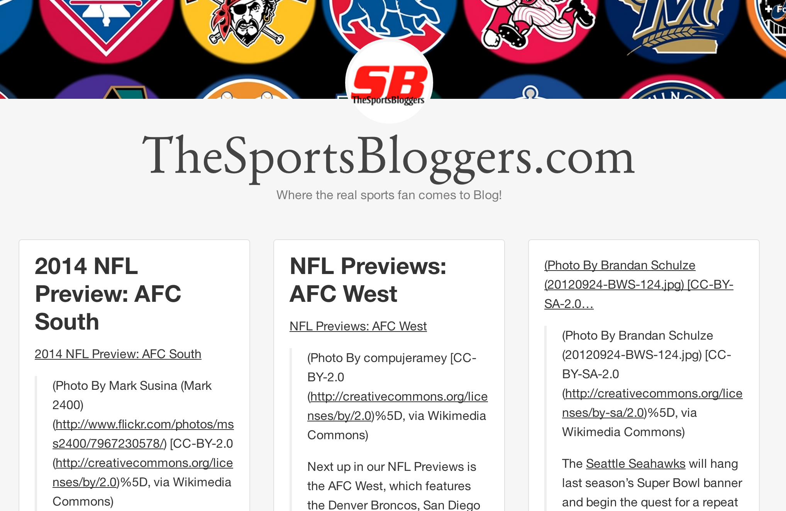
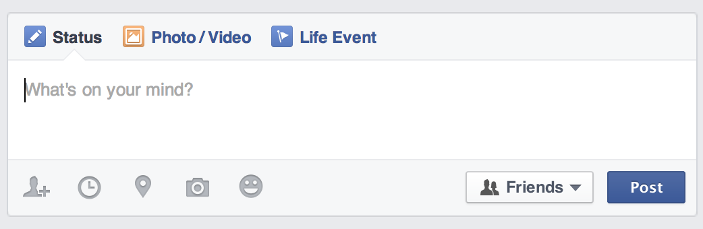
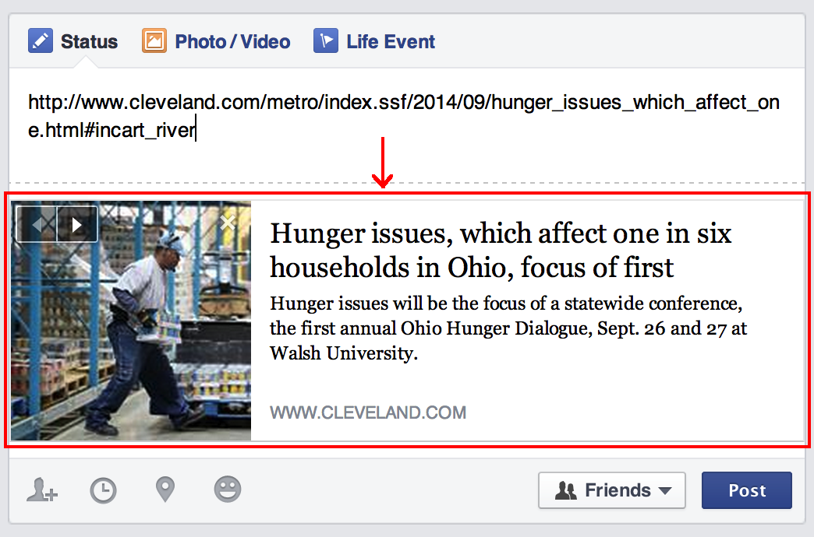

# Team Microblog



A microblog allows users to create, devour, update, and delete miniature blog posts. You will be creating a team microblog, which allows a group of users to create posts on a shared feed. These posts can reference outside links and scrape useful information from them (like texts and images), and add novel commentary, like *"LOLZ"* or *"haters gonna hate"*.

### Necessary for MVP

- **Resources**: `micro_posts`
- **User Story Frames**:
  - **(1) NEW & POST:** A user can create a new `micro_post` via a form... (`/micro_posts/new` -> `POST /micro_posts`)
  - **(2) SHOW:** A user can show (ie, see) a given `micro_post`... (`/micro_posts/micro-post-id`)
  - **(3) INDEX:** A user can see all of the `micro_posts` as a *feed*, up to a maximum of ten... (`/micro_posts`)
  - **(4) INDEX:** A user can browse successive pages of ten `micro_posts` each, until the beginning of the feed... (`/micro_posts?first=id-of-first-micro-post`)
  - **(5) DELETE:** A user can delete a `micro_post`... (`/micro_posts/micro-post-id/edit` -> `DELETE /micro_posts/micro-post-id`)
  - A user can add a link to a `micro_post` as a *snippet*...
  - When a `micro_post` is created, the creator can add any number of "topics" or "hashtags" to a post as a *tag*...
  - A user can view `micro_posts` posts by tag... (`/tag/tagname/micro_posts`)
- **Technologies or Features**:
  - Links within a `micro_post` should be formatted as a [snippet<sup>1</sup>](#snippets), i.e. they should "[scrape](http://en.wikipedia.org/wiki/Web_scraping)" an appropriate title, description, and image from the linked site. [The metadata will be retrieved following the protocol of Google+](https://developers.google.com/+/web/snippet), and can be parsed using [Mechanize](https://github.com/sparklemotion/mechanize) (recommended) or [Nokogiri](https://github.com/sparklemotion/nokogiri).

### Bonus

- **Feeds**:
  - A user can read **the feed** as RSS... (`/rss`)
  - A user can read a `micro_post` as [JSON<sup>4</sup>](#servejson)... (`/as/micro-post-id`)
  - The feed of posts will be [alternately consumable<sup>2</sup>](#metalinks) as:
    - an [RSS (XML) feed](http://ruby-doc.org/stdlib-2.1.2/libdoc/rss/rdoc/RSS.html), and
    - a [JSON activity stream<sup>3</sup>](#activitystream).
- **Data Model**:
  - A `micro_post` can have many associated `micro_posts` as `reblogged_micro_posts`.
  - Reblogged `micro_posts` belong to another `micro_post` as a `referenced_micro_post`.
- **User Story Frames**:
  - A user can write a `micro_post` as markdown and have it rendered as HTML...
  - A user can see the name of the `micro_post`'s author...
  - A user can view `micro_posts` posts by author... (`/authors/authorhandle/posts`)
  - A user can ***reblog*** (ie, *reference*) an existing `micro_post` in a new `micro_post`...
  - A user can identify a referenced `micro_post` in a reblog as a separate snippet...
  - A user can write a `micro_post` that is "sticky" (stays at the top of the feed, or after a previously stuck `micro_post`) and has a "life" (in seconds, the time until it becomes "unstuck") of up to two weeks...
  - A user can search `micro_posts` by tag, title and/or author...
  - A user can delete a `micro_post` only if they created it...
  - A user can update a `micro_post` only if they created it...
- **Consumed APIs**:
  - **Tag searching (>= 1 of the below or another appropriate API)**: A user can view recent tweets (or instagrams, tumblog posts, etc.) associated with a given `micro_post`'s tag alongside other `micro_posts` that share that tag... (`/tags/tagname/feeds`)
    - [Twitter](https://dev.twitter.com/docs/api)
    - [Instagram](http://instagram.com/developer/)
    - [Tumblr](http://www.tumblr.com/docs/en/api/v2)
  - **User authentication (using one or both of the below providers)**: A user can authenticate (sign in) to the micro blog via an OAuth provider...
    - [Facebook](https://developers.facebook.com/docs/facebook-login/manually-build-a-login-flow/v2.1)
    - [Google](https://developers.google.com/accounts/docs/OAuth2WebServer)

### Examples

- A sports team or fan site, such [as found on Tumblr](http://thesportsbloggers.tumblr.com/).
- A thought blog with multiple contributors, like [Language Log](http://languagelog.ldc.upenn.edu/nll/).
- A company blog, like [Signal vs Noise](https://signalvnoise.com/).
- A link-sharing aggregator, like [Arts & Letters Daily](http://www.aldaily.com/).

---

##### <a name="snippets"></a> __1.__ Displaying "snippets" with links

You may be familiar with this from social media and sharing websites. Here is an example from Facebook:

When you "post" a status in Facebook, you see an empty field like this.



And when you paste in a link, Facebook displays data as a snippet of information about the page being linked.



This is done automatically by Facebook using AJAX (Javascript), but we only need to get that same data and present it once our `micro_post` has been created.

##### <a name="metalinks"></a> __2.__ Publishing as feeds in the semantic web

You can use microformats in your document head to let your users know that they can consume your site using other avenues, as such:

```html
<link rel="canonical" href="http://domain.tld/posts/post-id" />
<link rel="alternate" type="application/rss+xml" title="Post Title" href="/rss/post-id" />
<link rel="alternate" type="application/activitystream+json" title="Post Title" href="/as/post-id" />
```

##### <a name="activitystream"></a> __3.__ JSON Activity Streams

[Activity Streams](http://en.wikipedia.org/wiki/Activity_Streams_(format)) are complex feeds that explain what is happenning on your site. Your AS feed would be served from the endpoint `/as` and would record all the posting activity on the blog. This sort of feed could be generated using a gem, [for example](https://github.com/nov/activitystreams), but that is not necessary!

**Instead, what is necessary is to offer up a JSON representation of a post at the endpoint `/as/post-id`** -- a much simpler option.

##### <a name="servejson"></a> __4.__ Serving JSON from Sinatra


It's as easy as [this](http://nathanhoad.net/how-to-return-json-from-sinatra)!
