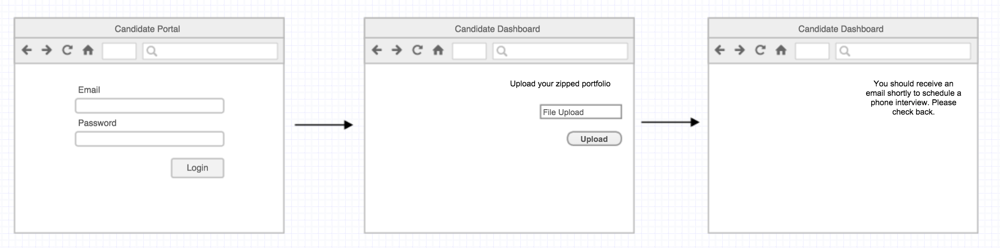

# Admissions Tracker

Track leads through the Admissions Process.

### The Submission

A prospective candidate should be able to visit a portal and upload their application.

### The Phone Screen

An admissions officer can log into the Admissions Portal and select a student for a phone screen.

They should be presented with a form to fill out an admissions questionaire.

The interview should be timeboxed, so provide an onscreen timer for 10 minutes.

### The Instructor Interview

An instructor can log into the Admissions Portal and select a student for an in-person interview.

They should be presented with a form to fill out an admissions questionaire.

An instructor cannot select a student until the phone interview has been completed.

### The Student Portal

An applicant may visit the portal and enter their information to check on the status of their application.

An admissions officer may log in and see a more detailed view of a student's application.

### Emails

Once the application process has begun, a candidate should receive an email inviting them to log into the student panel and check the status of their submission. The status page should list any next steps for the student.
