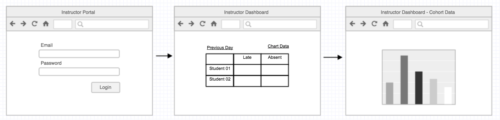
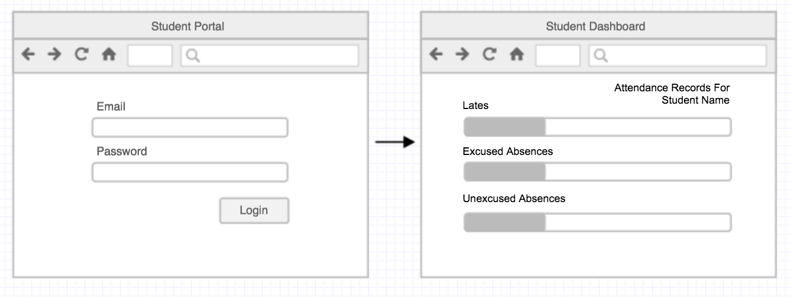
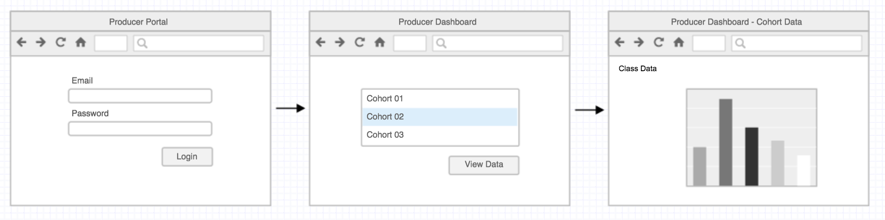
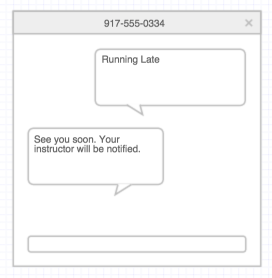
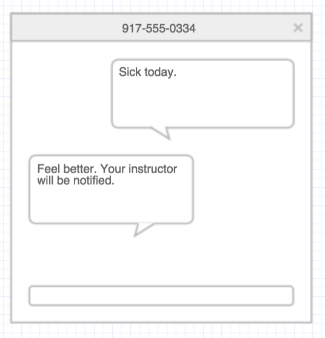

# Attendance Tracker

Track students attendance through their course.

### Instructor Portal

An instructor may log in and view a roster of their class. They should be able to mark every student as Late, Unexcused Absence or Excused Absence.

An instructor may view previous days attendance and the overall student data.

### Student Portal

A student may log in and view their attendance record.

As a student accrues lates and absences, 4 lates will equal one absence. After 4 absences their page should display a notification that they need to contact their course producer with a link to email the producer.

### The Producer Portal

A course producer may run several WDIs.  When they log into the Producer Portal they should be able to see a list of the classes they're producing.

A producer should be able to view the attendance records for each class and a list of any students they may need to contact.

### Running Late

A student may text a mobile number to alert their instructors that they are running late. This will be registered as a "lateness".

A student may text a mobile number to alert their instructors that they'll be out sick. This will be registered as an "excused absense".

