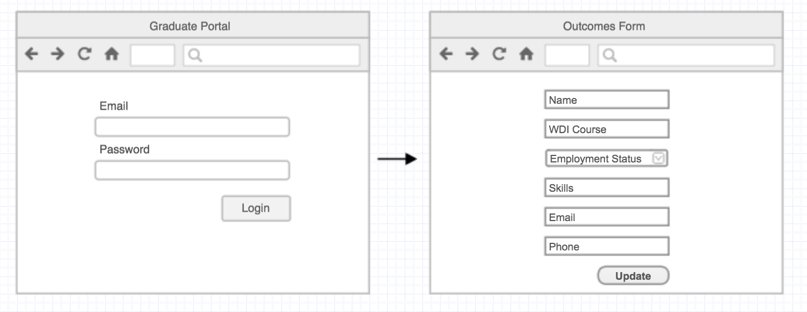
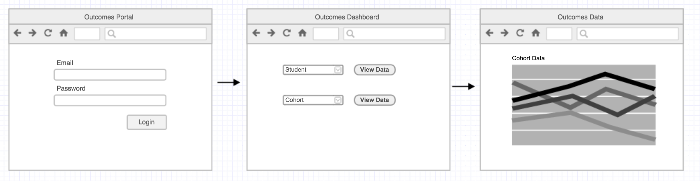
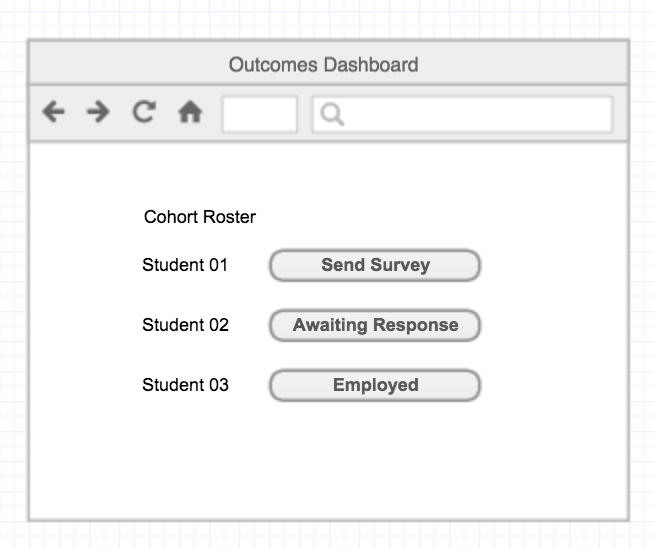
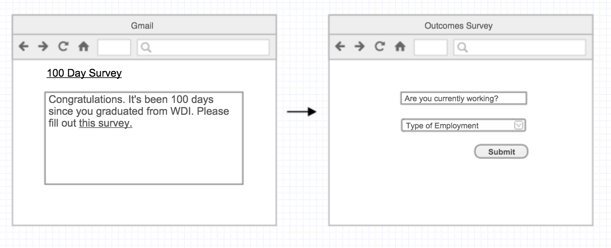

# Alumni & Outcomes Tracker

Track graduates of the course.

## Student Portal

A student may log in and update their employment status and skills.

## The Outcomes Portal

An outcomes officer may log in and view information about a particular graduate or data on a entire class or the program as a whole.

The outcomes officer can view the percentage of students currently with jobs in a class, or course and the percentage who received jobs in the first 90 days.

## Hundred Day Survey

Students who graduated over 100 days ago should be elligible to receive a 100 Day Survey.

An Outcomes officer can view a list of students by class and click a button to send out links to the survey..

## From Outcomes to Alumni

The graduated students should receive an email with a link back to the Outcomes Tracker to fill out a survey.

Once a student completes the 100 Day survey and states they are "employed" they become an "Alumni"

Until a student becomes an "Alumni" they are considered an "Outcome"

