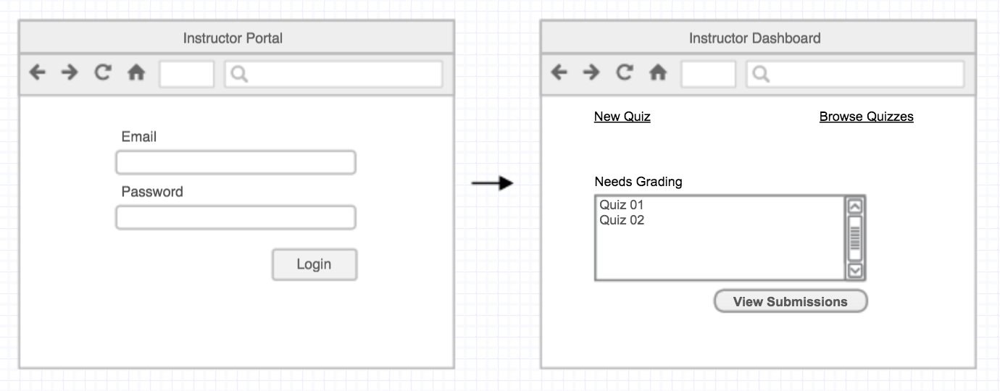
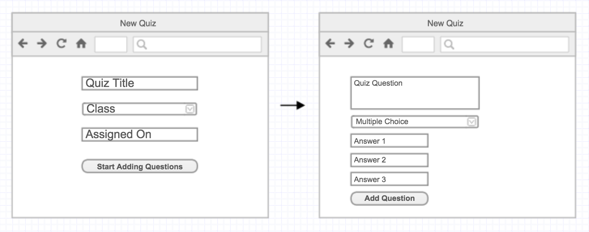
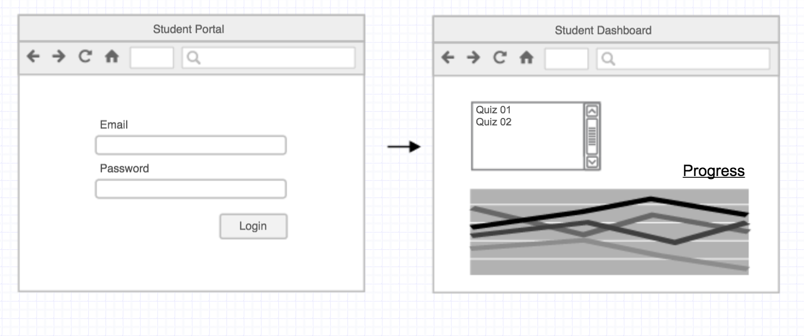
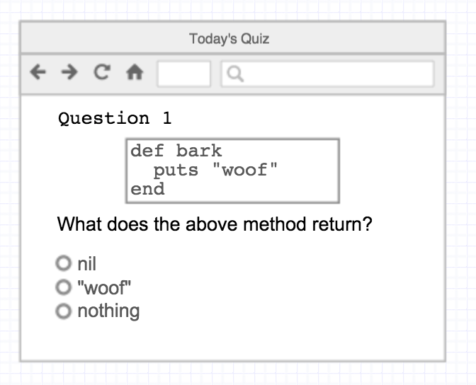
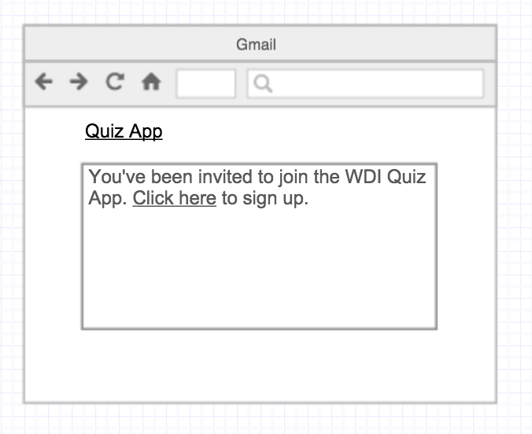

# Quiz Builder

Create and share quizzes for class.

### The Instructor Dashboard

When an instructor logs in they should have a dashboard that has a link to create a new quiz, lists quizzes they've created, and any notifications about quizzes students have taken that need to be graded.

### Quiz Creation

An instructor can log in and create a new quiz for a class.
Class information should come from the wdi api. Quizzes may have multiple choice or free-form answers. The questions may be formatted in Markdown to allow code snippets.

An instructor may browse quizzes created by other instructors and assign them to their class.

### The Student Portal

When a student logs in they should be able to view their old quizzes and see their progress.

### Quiz Taking

If a quiz has been assigned for that day, a student can go directly to it by visiting `/quiz`.
If a quiz hasn't been assigned for that day, `/quiz` should say so.

### The Signup process

When an instructor creates a new class through the Quiz app, each student should receive an email with a link back to the app for them to either sign up or login. (If they've already taken a class at GA, they should be able to log in with the same account).

