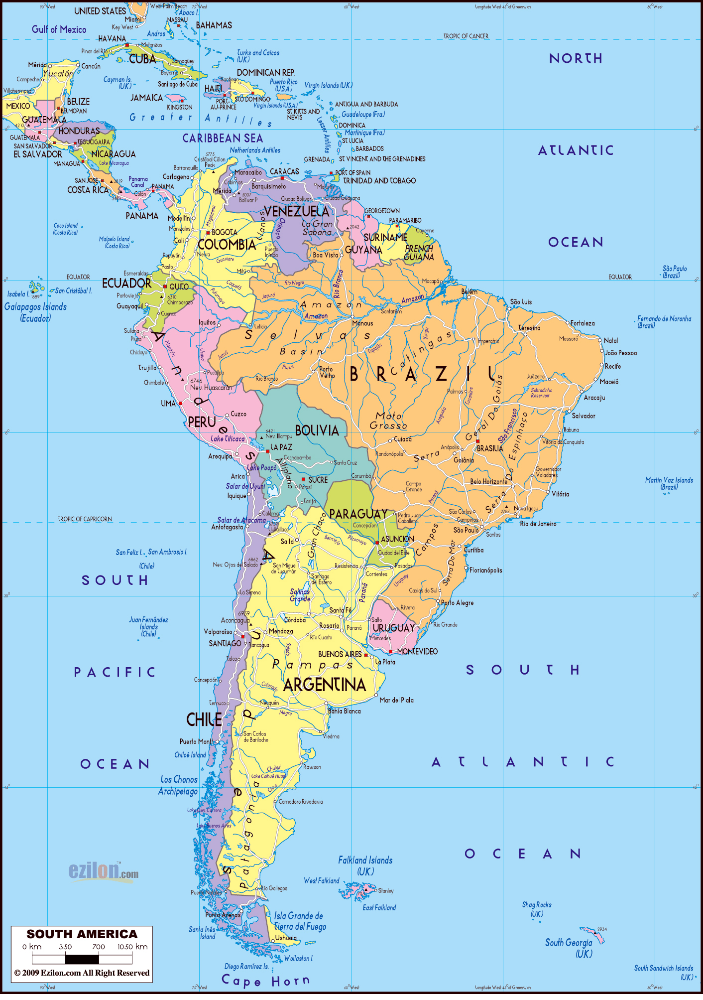

# The Amazing Race &ndash; South America, Part I

Are you all tired of learning program and dealing with this winter *already*? Well then, let's visit South America the best way we know how: as part of a ridiculous and somewhat offensive [reality TV show](http://en.wikipedia.org/wiki/The_Amazing_Race)!




## Installation & Setup

Install the The Amazing Race gem, and run it! Type the following in to your terminal:

```
$ cd ~/dev/wdi
$ bash <(curl -sL http://goo.gl/9AKg8j)
Building your map...
```

After that you should have a directory called `south_america` and one called `north_america` with a number of directories inside of it.

## Directions

We start our tour in **Miami**, **Florida**. To get there, we must head in to the directory `north_america`... Type the following:

```
$ cd north_america/florida/miami
```

What is there in Miami, Florida?

```
$ ls
south_beach
coconut_grove
miami_international_airport
```

Well then, let's go to the airport!

```
cd miami_international_airport
```

Now we are ready to begin!

### Leg 1: Miami to Bogotá

> Fly in to Bogotá, Colombia. Once there, we can follow the lead of [the former mayor](http://en.wikipedia.org/wiki/Antanas_Mockus) and use mimes to enforce regulations! We can go to the Plaza Bolívar and start handing out foolish and preposterous tickets to passers-by. Now *that's* television!

1. `cd` in to the directory `south_america`, where you can `cd` in to the directory `colombia`, and finally in to the directory `bogota`.
1. Once in `bogota`, go to the `plaza_bolivar`.
1. In the `plaza_bolivar`, create three files using `touch`:
  - `20_000_pesos_for_dog_barking`
  - `5000_pesos_for_socks_not_matching`
  - `10_000_pesos_for_frowning`

### Leg 2: Bogotá to Machu Picchu

> Fly in to Cuzco, Peru, and then head to Machu Picchu. Once you've climbed up to Machu Picchu, you have to "Rope a Basket" and then "Rope Some Llamas!"

1. `cd` into `peru/cuzco`.
1. `cd` back in to `peru`, and then `machu_picchu`.
1. Create the files `rope_basket` and `llama_pen`.
1. Using `echo` (`echo 'text' >> filename`) add the string "Llama" into the file `llama_pen`, **twice**!
1. Use `cat` to print the contents of the `llama_pen` to make sure both of them are in there!


### Leg 3: Machu Picchu to Iquitos

> Head back to Cuzco, and then fly to Iquitos, Peru. Once there, you can travel outside of the city and fix a small boat with local fishermen. Then you can barter that boat for Masato: Amazonian beer made from mashed cassava and spit!

1. `cd` into `peru/cuzco`.
1. `cd` into `peru/iquitos`.
1. Create a new directory called `rickety_bus_ride`
1. `cd` into `peru/iquitos/rickety_bus_ride`.
1. Create a new file called `small_boat`.
1. Use `mv` to rename that file `masato`.

### Leg 4: Iquitos to Manaus

> It's time to travel further away from "civilization" than you and your suburban, type-A friends have ever felt comfortable going before! Travel down the Amazon River to the great jungle metropolis Manaus, in Brazil. Once in Manaus, you have to perform in the famous "Teatro Amazonas" -- a great opera house! Sing a section of Carmen, and then you can be on your way!

1. `cd` into Brazil. Use `ls` or `ll` to find what is there.
1. `cd` on to the `amazon_river`.
1. `cd` next to `manaus`, and from there in to the `teatro_amazonas`.
1. Use Sublime Text to open the file `carmen_libretto`, and add to it the text from the first scene of the opera, [found here](http://opera.stanford.edu/Bizet/Carmen/acte1.html#num1).

### Leg 5: Manaus to Rio de Janeiro

> Now that we've been to the jungle, let's enjoy the beach! Travel to the Acadêmicos de Santa Cruz samba school in Rio de Janeiro rio and begin making costumes! Once you've made enough, you have to dance to the samba beat!

1. `cd` into `rio_de_janeiro` in Brazil.
1. `cd` to the `academicos_de_santa_cruz`.
1. Copy the file `outrageously_sexy_costume` three times using `cp`.
1. Create a new directory called `parade`, and `mv` the costumes into it. `cd` into the `parade` yourself.
1. Create a new file called `samba_like_you_mean_it`.
1. Echo to the screen 'I love life!'

<!--
### Leg 6: Rio de Janeiro to Iguazu

cat
> iguazu

### Leg 7: Iguazu to Patagonia

> patagonia

### Leg 8: Patagonia to Valparaíso

> valparaiso Ascensors (funiculars)

### Leg 9: Valparaíso to the Atacama

> drive up to atacama and mine salt

### Leg 10: The Atacama to La Paz

> go to a market in La Paz and buy a whole chola dress

### Leg 11: La Paz to Quito

> ...

### Leg 12: Quito to Miami

> ...
-->

Nicely done! Welcome home guys: we've lost our dignity, but we made somewhat less than scale for a few weeks and might have a moderately lucrative endorsement deal in the works. Sounds like a great trade-off to me!
