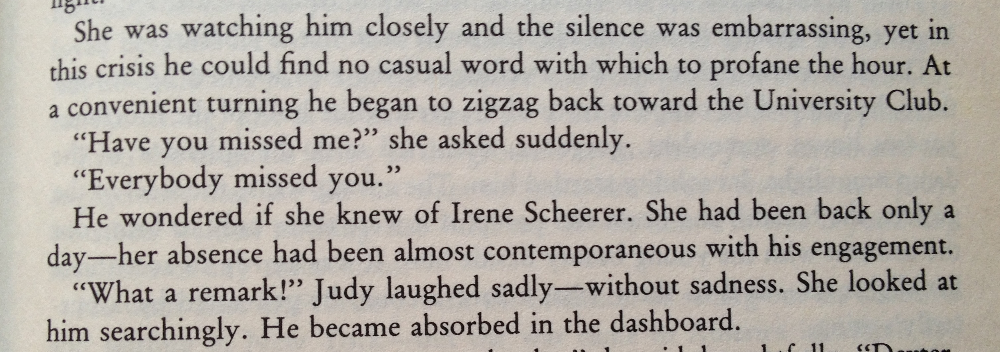

## Special Characters Exercise

You just learned how to add special characters to strings. You've been tasked with putting that knowledge to use to recreate the text layout seen in the paragraph below.

#### Exercise Objectives

- become comfortable using special characters within double-quoted strings

#### Directions

1. Open the `winters_dream_excerpt.rb` file found in `w01/d02/student`
1. Make your terminal full screen and run the ruby file via `ruby winter_dreams_excerpt.rb`
1. Add special characters (indentation, linebreaks, and double quotes) to the string so that it prints like the mockup below.

#### Mockup

