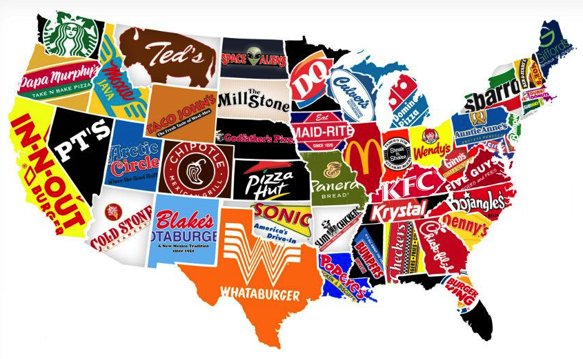

# Franchises!



> It may seem like we don't use classes that often, since we usually don't use the
> objects' class names in our code, but that's because *the most common classes in
> Ruby* (those above) *have a special syntax to create instances*.

The standard way to create objects is by **calling a method on their class**
called `.new` Let's define a new class and use it to create some objects...

### Part I - Setup

**filenames:** `mc_donalds.rb`, `franchises.rb`

Create a file for the `McDonalds` class (the name is in CamelCase, and the file
should be in snake_case), and then define the class inside it. Create the file
`franchises.rb`, load the `McDonalds` class with `require_relative`, and then
run the following code to make sure it works:

```ruby
greenpoint_ave_mcd = McDonalds.new
$stdout.puts(greenpoint_ave_mcd.class) #=> McDonalds
```

### Part II - Making Franchises

**Remove the above code from `franchises.rb`!**

Add some state to the `McDonalds` class in the form of attributes! Every instance
(or *franchise*...) of `McDonald`s needs to have a location, a capacity, an open
and closing time, a Yelp page and a manager. Make sure the following code works
when added to `franchises.rb`.

```ruby
chelsea_mcd = McDonalds.new(
  "335 8th Ave, New York, NY  10001",
  105, "07:00", "23:00",
  "http://www.yelp.com/biz/mcdonalds-new-york-136",
  "Marco Diaz"
)
chelsea_mcd.location #=> "335 8th Ave, New York, NY  10001"
chelsea_mcd.capacity #=> 105
chelsea_mcd.open_at  #=> "06:00"
chelsea_mcd.close_at #=> "23:00"
chelsea_mcd.yelp     #=> "http://www.yelp.com/biz/mcdonalds-new-york-136"
chelsea_mcd.manager  #=> "Marco Diaz"

union_square_mcd = McDonalds.new(
  "39 Union Sq W, New York, NY  10003",
  60, "7:00am", "12:00am",
  "http://www.yelp.com/biz/mcdonalds-new-york-105",
  "Terry Johnson"
)
union_square_mcd.manager  = "Helina Senai"
union_square_mcd.capacity = 65
union_square_mcd.open_at  = "06:00"
union_square_mcd.close_at = "23:30"
```

> Important question: which of these attributes should have setters, and which
> should have getters? If you can determine each, use attr_reader, attr_writer
> and attr_accessor to define them.

### Part III - Getting Down to Business

Now we can add some behavior to the `McDonalds` instances by defining some more
instance methods. Let's create the following methods:

- `#order`: a method which:
   - takes two arguments as input, (1) an integer number, and (2) a string menu
   item (for example, "happy meals" or "big mac")
   - returns as output a string that says:
   "Here is your order of <NUM> <MENUTIEM>. Thank you."
- `#is_open_at?`: a predicate method (ie, returns true or false) that takes a
single argument of a time represented in 24-hour format, and says whether or not
the store is open (Hint: use `#gsub` and `#to_i`)
- `#served`: a method that takes no arguments and returns the number of menu
items (the sum total of the integers sent to `#order`) this franchise has served

Examples (add to `franchises.rb`, after the above):

```ruby
$stdout.puts(chelsea_mcd.is_open_at?("23:30"))      # >> false
$stdout.puts(union_square_mcd.is_open_at?("23:30")) # >> true

$stdout.puts(chelsea_mcd.order(5, "happy meals"))
  # >> "Here is your order of 5 happy meals. Thank you."
$stdout.puts(union_square_mcd.order(1, "big mac"))          # >> ...
$stdout.puts(union_square_mcd.order(1, "chicken sandwich")) # >> ...
$stdout.puts(union_square_mcd.order(1, "filet o' fish"))    # >> ...

$stdout.puts(chelsea_mcd.served)      # >> 5
$stdout.puts(union_square_mcd.served) # >> 3
```

> Require pry and add a binding.pry to the end of `franchises.rb`. Explore your
> objects using `cd`, `ls`, and `show-method`. Also explore the class. What is
> the same? What is different?

===

### Part IV - Are You Being Served?

Write a method that will allow us to figure out the total number of menu items
served by every `McDonalds` franchise, combined.

> Important question: where do we define such a method? How is it different from
> the previous methods we've defined?

Example (add to `franchises.rb`, after the above):

```ruby
McDonalds.served #=> 8
```

### Part V - Welcome to...

Add a class variable to `McDonalds` that holds the value:

```
"Welcome to McDonald's, may I take your order?"
```

Make sure that when you use `#order` at any franchise, the server says that line
before "serving" the food.

Example (use in `franchises.rb`, after the above):

```ruby
chelsea_mcd.order(2, "shakes")
#=> "Welcome to McDonalds, may I take your order?"
#=> "Here is your order of 2 shakes. Thank you."
```

> Important question: will that value ever change? If not, should it be a
> variable or a constant? What changes when we use a constant? Try it with one
> named GREETING.

### Part VI - McRib

Write a class method on `McDonalds` to get the status of the McRib, which is set
to `false` by default. Then write an instance method that will get that status,
in the form of a predicate method.

- class method `.mc_rib`
- instance method `#has_mc_rib?`

Example (use in `franchises.rb`, after the above):

```ruby
McDonalds.mc_rib        #=> false
chelsea_mcd.has_mc_rib? #=> false
```

### Part VII - McRib Redux

The time has come! Create the class method: `McDonalds.toggle_mc_rib`, which
will set the status of the McRib to `true` if it was `false`, and `false` if it
was `true`.

Example (add to `franchises.rb`, after the above):

```ruby
McDonalds.toggle_mc_rib
union_square_mcd.has_mc_rib? #=> true
```

<!--
### Part ...

**filename:** `burger_king.rb`

### Part ...

**filenames:** `arbys.rb`, `wendys.rb`

### Part ...

**filename:** `food_court.rb`
 -->
