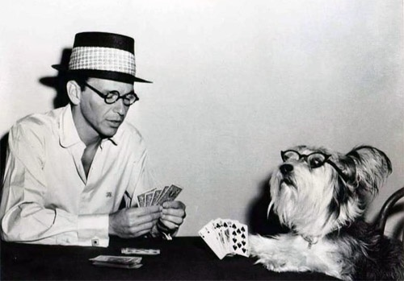

# Sinatra Games

> This week you've met Sinatra, the one and only. Sure he's a smooth talker, and
> he's got some moves. But today, today we're really gonna *swing*!

## Setup

You are now in your `sinatra_games` folder. Within this folder, each part below
will get it's own subfolder. The name of the subfolder will be given.

Good luck, and have fun!

## Part 1 - Parlour Games

Work in the folder `sinatra_games/parlour`. Now we are going to create some
parlour game tools: `coins` and `dice`.

### Step 1 - Pennies from Heavan

Create a class `Parlour::Coin` that has a single behavior: `.flip`. `.flip` is
a class method that takes no input and returns, at random, the strings:

- `"heads"`, or
- `"tails"`

Where do we put `Parlour::Coin`? Well, it's in a module `Parlour`, and it is has
a class name of `Coin`, thus we should put it in a directory (or folder)
`parlour` and a file named `coin.rb`: `sinatra_games/parlour/coin.rb`.

### Step 2 - Server-building

Next, create a simple Sinatra server named `Parlour::Server`. This server has a
single route `GET /coin_toss`.

Then create your `config.ru`, and use it to load all the necessary code:

- `sinatra/base`
- `server`
- `coin`

Have the route `coin_toss` return a value from `Parlour::Coin.flip`.

Finally, make sure the value is returned in valid HTML, with a link to:
`Try Again!` that does another coin toss.

### Step 3 - I Did it My Way

Add to your `GET /coin_toss` route the ability to handle guesses. The route
looks for a "param" key `guess` (`http://localhost:9292/coin_toss?guess=heads`,
eg). If there is a guess that is either "heads" or "tails", it also returns
whether or not your guess was correct.

Now we're playing, baby!

## Part 2 - Luck Be a Lady

Create a class `Parlour::Dice`. Dice have the following behaviors:

- `Parlour::Dice.roll(a_number_of_sides) → a_random_value`
- `Parlour::Dice.new(an_array_of_number_of_sides) → a_dice_instance`
- `Parlour::Dice#roll → an_array_of_the_dice_outcome`
- `Parlour::Dice#roll_and_sum → the_sum_of_the_rolled_values`

Add to your server the route:

- `GET /dice_roll`
  - randomly returns a number between 1 and 6 in an HTML page similar to the
    coin toss page above (with a `Try Again!` link)
  - if there is a parameter `number_of_dice=...`, then we can return a list of
    all the dice values rolled
  - if there is a second parameter `total=true`, then instead of returning a
    list of values, you just return the number of dice rolled and the summed
    value of them!

----

**Do not make changes to this file!** You will be pulling updates to it and you
do not want to get merge conflicts!
