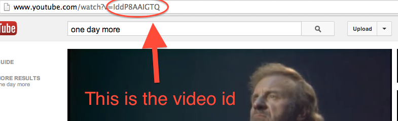

## Star Stalker
 


Star Stalker is a fan site dedicated to stars of all kinds, both living and dead. 

#### Completion

Completion for tonight's assignment is to get through part 4.

#### Part 1: Directory Structure

Within your `star_stalker` directory, add the following directory structure. Make sure you can  effectively start your server before moving on to part two.

```
├── config.ru
├── star_power.rb  <- This file is already included
├── server.rb
├── images         <- This directory and its files are already included
│   ├── youtube_url.png
│   └── youtube_id.png
├── public
│   └── stylesheets
│       └── style.css
└── views
    ├── index.erb
    └── default_layout.erb
```

#### Part 2: The Root

GET requests made to the root url should welcome visitors to StarStalker.com, home of celebrity info and multimedia (get creative if you feel like it). The page should also provide anchor tags to the following links:
  - to `"/about"`
  - to `"/stars"`

#### Part 3: The `"/about"` page

GET requests made to `"/about"` should display a heading that says "About Star Stalker", followed by some text explaining the origins of Star Stalker (who runs it, when it was established, and so on).

#### Part 3: The `"/stars"` page

GET requests to `"/stars"`" should display an unordered list of names for each of the stars provided in `StarPower::STARS` in [`star_power.rb`](star_power.rb). Each list item should also be a link, following the pattern below. 

__Link pattern:__
Jim Morrison is at index 0, so the link representing him should go to `"/stars/0"` 
Michael Jackson is at index 1, so the link representing him should go to `"/stars/1"` 
Madonna is at index 2, so the link representing her should be `"/stars/2"` 
...and so on.

#### Part 4: Star Profiles

Create a dynamic star profile page, so that GET requests to `"/stars/0"` displays the info for the star at index value 0 within the `STARS` array, and GET requests to `"/stars/27"` would display the info for the star at at index value 27 (once we have that many stars)

For each star, display their name, date of birth, and photo.

Each profile page should also provide a link back to the `"/stars"` page. 

#### Part 5: Filtering The Stars in Your Gallery

Make it so that GET requests to `"/stars?alive=false"`, lists only deceased stars. Similarly, if someone makes a GET request to `"/stars?alive=true"`, the list should only show the stars that are still alive.

#### Part 6: Video!

Read up on [how to embed a youtube video](https://developers.google.com/youtube/player_parameters#Embedding_a_Player) in a webpage.

Here's what the url looks like:


Here's here you find the video_id:


#### Part 7: Lookin' Good

1. Add `normalize.css`
1. Center your pages with `margin: 0 auto; width: 960px`
1. Add `:hover` effects to all your links
1. Run your CSS through the [CSS Validator](http://jigsaw.w3.org/css-validator/) and make the appropriate changes so it's all valid.

#### Part 8

Require Ruby's `Date` library in `star_power.rb` and update the `STARS` array so that `born_on` on points to a `Date` object instead of a string like in the example below:

`:born_on => "June 7, 1977"` would change to  `:born_on => Date.parse("June 7, 1977")`

What changes will you have to make to `server.rb` so that everything still runs?

