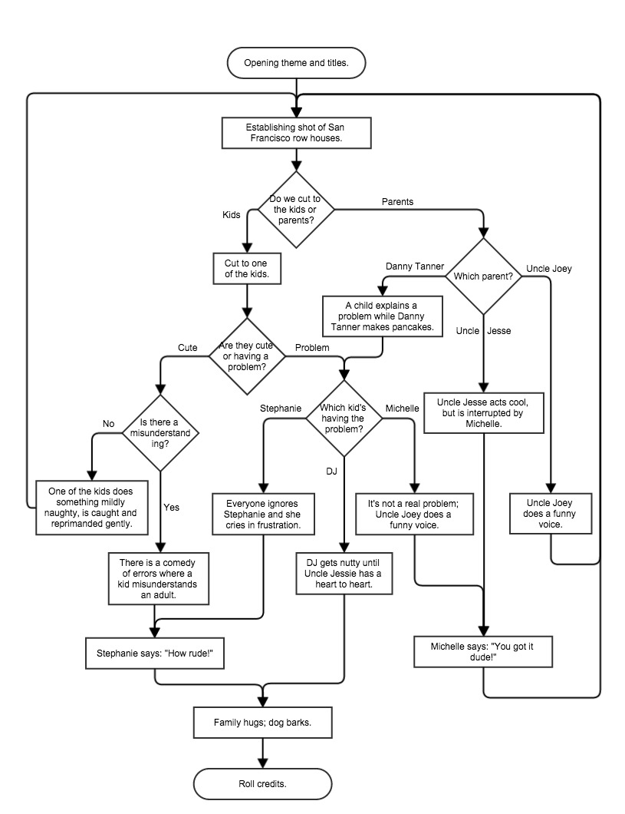

# Full House Script Generator, the Web App!


You've worked on the concept of creating a decision tree, and then using it to
help you construct a procedural computer program. You've also had exercises
where you conduct users of a website to the desired outcome using routes and
links. Now we are going to put the two together!

We're going to make an app that helps you write a script for
[Full House](http://en.wikipedia.org/wiki/Full_House)!

## Setup

Create a Sinatra application in this folder. There is not any deep logic, just
a series of links to implement, so you do not need to create any extra files,
classes, objects, etc.: just a Sinatra app!

#### Completion

**Please complete through part 5.** As always: more is better;
healthy living is best. Only do the bonus if you have completed every single
part.

As an added note: parts 6-9 are difficult, but will be a BIG help for you to be
able to do as we move forward. If you can't get to them yet, it would be worth
your time to return to them in the future.

#### Flowchart

Here is the flowchart you will use (click to expand):

<!--  -->


## Part 1 - Planning

Using the above flowchart/decision tree, write out the structure of your app.
Each decision in the process (**the diamonds**) is a page, and any choices will
be links on that page. *This does not mean that every node in the tree is its
own page!* Since there are five decisions and a beginning and end (the rounded
boxes), that means there are **seven** pages or *routes*.

Decide the names for each *route* (or page), and the links that the page will
have.

## Part 2 - Server & Routes

Get your server up and running! Then implement each route, checking to make sure
that the language is correct for each page.

## Part 3 - HTML

Rewrite your routes' output to use correctly formatted HTML. Each page will
either have a series of options represented as links or buttons, and each
option will link to the appropriate page. **Ensure that every page has a header
with a link back to the `index` or starting page at the route `GET /`.

Structure the page correctly with `<div>`, `<a>`, `<span>`, `<p>`, or `<button>`
tags as necessary, adding classes where appropriate (**note:** divs should
almost always have a class).

To simplify your writing, make sure to use a common layout template (ERB)!

## Part 4 - Images

Add images to every page, to illustrate the current story "beat." You can use
any you find on the Internet, but a small group of have been provided locally in
the `img` folder.

## Part 5 - CSS

Make the site readable and usable. Try and theme the style to fit with the
wholesome, family-oriented atmosphere of the presidency of George HW Bush.

Suggestions:

- fonts: Comic Sans, or
  ["handwritting" Google fonts if you're daring](https://www.google.com/fonts)
- colors:
```
"#9900FF" # neon light purple
"#7920FF" # neon purple
"#6600FF" # neon dark purple
"#00FFFF" # neon light blue
"#0000FF" # neon dark blue
"#FF00FF" # neon pink
"#FD0987" # magenta pink
"#FF0000" # neon red
"#FF3300" # neon orange
"#FFFF00" # neon yellow
"#00FF00" # neon green
```
- [tiled backgrounds](https://developer.mozilla.org/en-US/docs/Web/CSS/background-repeat)
  or [borders](https://developer.mozilla.org/en-US/docs/Web/CSS/border-image)
  made with [geometric](https://www.google.com/search?q=80s+geometric+patterns)
  [patterns](https://www.google.com/search?q=90s+geometric+patterns)

#### A Working App

At this point (completion), you should have a working app. If you'd like a guide
for how to build it, here is an example screenshot:

<!--  -->


## Part 6 - On the Net!

Create a `Gemfile` for your app, according to the
[example on the Heroku website](https://devcenter.heroku.com/articles/rack#frameworks).

Next, deploy it according to the example on the Heroku website:

- Test it locally:
```bash
bundle install
bundle exec rackup -p 9292 config.ru &
curl http://localhost:9292
```
- Deploy to Heroku:
```bash
git init
git add .
git commit -m 'pure rack app'
heroku create
git push heroku master
heroku open
```

Debug any issues by reading the error messages and using the Heroku docs or
Stack Overflow.

## Part 7 - Structured Data

Rewrite your app to use a few dynamic route handlers (`/:decision`, eg) and no
more than three ERB templates.

When you do this, hold the data about your site in a data structure internally.
An example would be a hash, like:

```ruby
EPISODE_TREE = {
  :opening => {
    :text => [
      "Opening titles and theme.",
      "Establishing shot of San Francisco Row Houses."
    ],
    :query => "Do we cut to the kids or parents?",
    :options => [
      {:kids    => :cut_to_kids},
      {:parents => :which_parent}
    ]
  },
  :cut_to_kids => ...
}
```

Now make a change to your decision tree! By splitting your view logic and your
data model, you can change the internals of your app on the fly. The preferred
process for this would be to:

- make the change in the flowchart first, so that you can envision the action;
- update the data structure accordingly;
- test it!

## Part 8 - Mocking Persistence

We haven't learned about persisting data with databases yet, but we cna still
pretend like our application "*holds state" (has a memory) by encoding our past
in every single request response cycle!

1. Add a query param `story=` to every single link that advances your story.
1. Make the value of the param the entire story so far..
  - this means we have to get the last value of story, and concatenate it to
    what the next part of the story would be for a given choice!
1. Because URLs (and thus query params) can only use certain characters, we have
   to encode and decode our story strings when we use them. You can do this
   using Ruby's standard library `URI` (check it out in `pry`).

Example:

```ruby
require 'uri'

@page_content = "Uncle Joey defuses a tense situation with bad humor."

story_so_far = URI.decode(params[:story])
updated_story = story_so_far + "\n" + @page_content

@prompt = "Does everyone laugh?"
@link_yes = "/everyone_laughs?story=" + \
            URI.encode(updated_story + "\n" + "Everyone laughs.")
```

> Once you can get this to work, it may be the perfect situation to refactor the
> logic in to a method to reuse it across your app!

**Finally**, have the final page print out the script you've created!

## Part 9 - Dynamic Visual Content

Use an internal hash to store the image links for the app, like:

```ruby
IMAGES = {
  :opening => "fh-opening-shot.jpg",
  :parents => "fh-parents-smile.jpg"
}
```

Use the above mock persistence to also keep track of the list of images in your
story in a query param `images`. Your query params may now look like:

```
?story=...&images=opening,parents,laughing,credits
```

You can use `split` and `join` in your route handler to make this work!

On the final page, you can use `each` in your view to print out the images
along with the script!

## Part 10 - Visible History

Make the script (so far) and the images visible on every single page, so that
the user can see their script as its being created.

## Bonus 1

1. Deploy your new app on Heroku.
1. Write a special version of the app (special CSS and new info in the data
   structures) to create Holidays-themed episodes!
1. Add a link to a pre-formatted `<pre>` version of the script for printing.
1. Restructure your views according to this wireframe:

<!--  -->


## Bonus 2

Make your app structure totally modular, so that you can choose on your landing
page (`"/"` or `index`) which program you want to generate a script for. You can
choose among the programs from the
[Execubots exercise](https://github.com/ga-students/godot/tree/master/w01/d03/student/img)
("Alf", "Mork & Mindy", "Dallas", "Married ... with Children", and
"Three's Company") or make your own!

Your data structure would need to now also include:

1. multiple decision trees keyed to different programs,
1. links to program-specific assets like:
  - CSS (all of them stored in your `/public/stylesheets` directory), and
  - images
1. links to social media to share your great new app!
