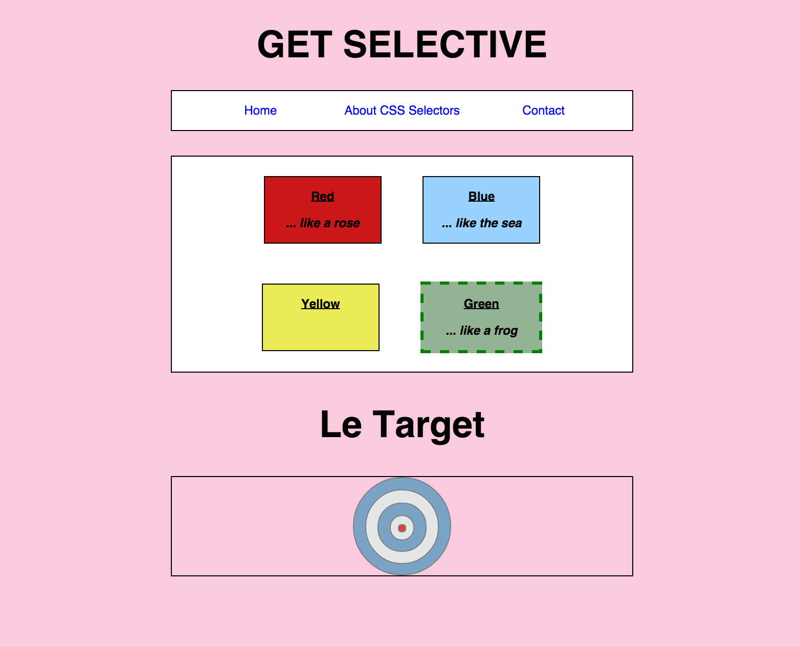

## Get Selective

Before we can *apply* styling to the elements in our HTML documents, we first have to know how to target or *select* those elements.

#### Directions

This is strictly a CSS exercise, so *don't change the HTML*. Additionally, there are pre-written styles for this exercise. Don't alter them, as this exercise was designed for you to work around what was already written. Do your work solely in the [`stylesheets/style.css`](stylesheets/style.css) file. 

1. If you haven't, read [Chris Coyier's introduction to CSS Selectors](http://CSS-tricks.com/how-css-selectors-work/)
1. Select any and all heading level 1 (`<h1>`) tags that might be on the page.
  - set the `h1`'s `text-transform` property to `uppercase`
1. Select any and all anchor (`<a>`) tags on the page
  - remove the underline from the anchor tags by setting their `text-decoration` to `none`
1. Select any and all paragraph (`
`) tags on the page
  - set the paragraphs' `font-weight` attribute to `bold`
1. Select the `div` with the class of `green`
  - set its `background-color` attribute to a nice shade of green: `rgb(148, 179, 148)`
  - set its `border` attribute to `5px dashed green`
1. Select all the elements that have a class of `ring`
  - set the rings' `border-color` property to `gray`
1. Select all the elements that have a class of `example`
  - set the example text's `font-style` attribute to `italic`
1. Select the `div` with the `id` of "bullseye"
  - set its `background-color` to a deep shade of red: `#D04A41`
1. Use the `:hover` pseudo-selector to make the bullseye's opacity shoot down to `0.5` when hovered over.
1. *Simultaneously* select the `h1` and `h2` tags
  - set the pair's `font-size` to `3em`
1. Select the div that has the two following classes: `target` & `container`
  - set its `background-color` to `#facade`
1. Someone put an inappropriate example for the color yellow into the HTML. We're going to use CSS to make this inappropriate text invisible
  - select the *second* paragraph tag within the div of class `yellow`
    - set its `opacity` to `0.0`
1. Each of the colored boxes has two paragraph tags. Select all of the *first* paragraphs within the colored boxes
  - set all of the first paragraphs' `text-decoration` to `underline`

#### What Your Page Will Look Like When Complete:

===

