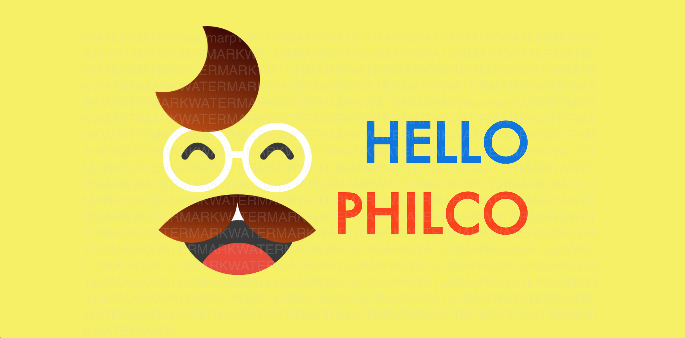

## Hello Philco

Phil Lamplugh's homepage is rather barebones, and thus makes an excellent starter exercise for HTML/CSS layout.

#### Directions

1. Take a look at [Phil's live website](http://hellophilco.com/).
1. Look over the files provided. You have at your disposal:
  - the [photo of Phil's animated likeness](images/philco_anime.png)
  - a webfont file
  - a [css stylesheet](stylesheets/style.css) with some starter code to bring in the webfont
  - an [empty html file](index.html).
1. Write the boilerplate html (`!DOCTYPE`, `html`, `head` and `body` tags) and link to the t
o the stylesheet provided. 
  - __Note:__ You'll know the file is linked correctly if the background color turns to yellow.
1. Write the html and css to replicate the layout for Phil Lamplugh's homepage, using CSS positioning to align the photo and text as it appears in the mockup below.

#### Potential Hiccups

- The `top`, `right`, `bottom` and `left` properties won't have any effect on statically positioned elements, and all elements have a position of `static` by default. So for them to have any effect, you'll first have to change the element's `position`.

#### Mockup

