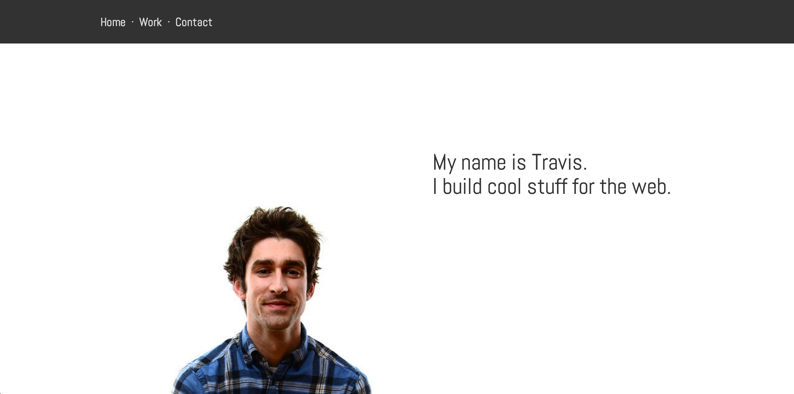

## Your Friend Travis: A layout exercise

Your teacher's portfolio was built with a heavy dose of JavaScript, but that doesn't mean you can't recreate the layout of the home section using pure HTML/CSS, and that's *exactly* what you're going to do. So do it!

#### Exercise Objectives

- gain meaningful repetitions using `inline-block` to lay out a list of elements in a row
- gain meaningful experience using your newfound css skills to build a complete layout

#### Directions

1. Write the html and css necessary to recreate the layout seen below.

#### Potential Headaches!

1. Chrome inexplicably adds 8 pixels of margin to the `<ul>` and `<ol>` elements. Welcome to your frustrating-but-dopamine-heavy life as a web developer! To thwart Chrome's attempts to thwart you, set `ul` element's `margin` property to `0px`.
1. For the `z-index` property to manipulate-able, you'll first have to set the `position` property to a non-static value.

#### Layout

