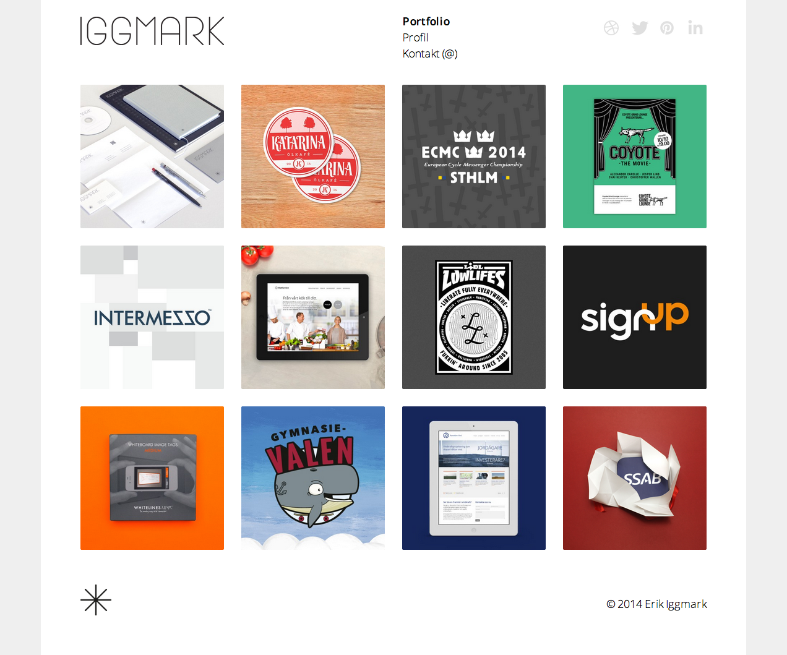

## Erik Iggmark Portfolio Layout

Here's [a clean, beautiful website](http://www.erikiggmark.se/). You've been tasked with rebuilding it.

#### Exercise Objectives

- get meaningful practice breaking down a layout
- get meaningful practice using `display:inline-block` to lay block-level elements out in rows
- bring in a webfont ('Open Sans') via Google Fonts
- use just the subtlest trace of `border-radius` around `img` tags

#### Directions

1. Take a look at the [live site](http://www.erikiggmark.se/). Get a feel for all the elements on the page.
1. Examine the image files. These will be the only assets provided. With them, you will recreate the layout below.

#### Mockup

