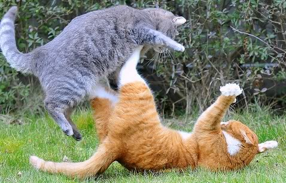
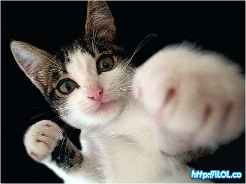
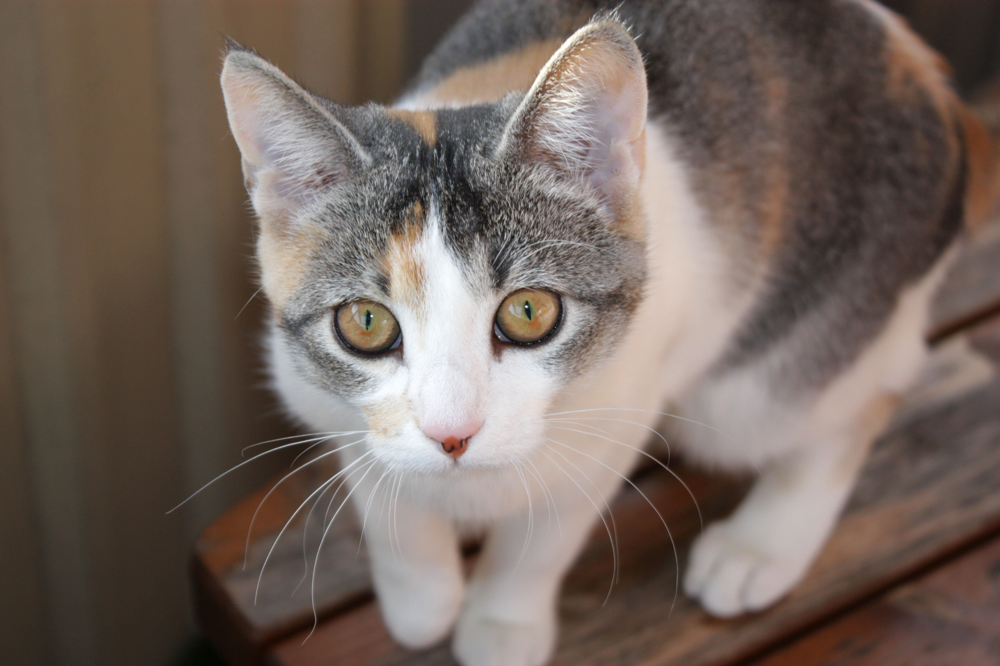

# CatTinder



> It's a fight; which *cat*-ender will win!?

Tonight we will use our knowledge of web application frameworks and simple
persistent storage to build a feature subset of everyone's favorite new
start-up: [Grindr](http://grindr.com). But with cats!

***Wait, I meant [Tinder](http://www.gotinder.com)!!!***

## Setup

Work in the current folder. Namespace your files with `CatTinder`.

### Completion

**Please finish through Part One at least.** Try to get through Part Three, but
if you find yourself stuck, you can go back and work on the Morning Exercise:
QVC Shenanigans.

As always: more is better; healthy living is best. Only do the bonus if you have
completed every single part.

## Part 1 - Get the Database Working

Inside this folder you will find the file [seed.rb](seed.rb). This file will put
test data into our local *development* database for when we are building our
app. This is known as **seeding** your database; thus the file is known as a
**seed file**.

> Explore the seed file! What kind of data is in it? How is our application
> being stored?

Run the *seed file*, open `redis-cli` and run the command:

```
lrange cat_ids 0 -1
```

This will ensure that all of your *cat ids* are available! From here on out,
when we refer to a *cat ids*, we mean the string `"1"`, if the hkey that
Redis stores it under is `"cat:1"`.

Next, create a **module** (using the correct file name)
`CatTinder::DatabaseHelper` that has the following *instance methods*:

1. `CatTinder::DatabaseHelper#ids`: gives you all of the cat keys.
1. `CatTinder::DatabaseHelper#image_url_for(id)`: gives you the URL for the
   cat's image, given its id.
1. `CatTinder::DatabaseHelper#votes_for(id)`: gives you the number of votes for
    a cat, given its id.
1. `CatTinder::DatabaseHelper#upvote!(id)`: increments the number of votes given
    a cat id.

Note: the best way to test this is to run `pry`, and then run:

```ruby
require_relative 'database_helper'

include CatTinder::DatabaseHelper

ids     # and etc... All your methods are now included locally!
```

## Part 2 - Sinatra-Redis Integration

We are now working on the Sinatra app in the current folder. The server class is
provided with some boilerplate. Make sure that we require our database helper
from above and include it!

```ruby
require_relative 'database_helper'

module CatTinder
  class Server < Sinatra::Base
    helper CatTinder::DatabaseHelper

  end
end
```

**Using `helper` includes the module and makes it available in the views!**

## Part 3 - Create the Routes

Now we make the website. This website will use Redis to store information about
some cats and who likes them. We need to write handlers for the following routes:

#### Site Root

Route: `GET /`

A welcome page for the website. It should say:

```
Welcome to CatTinder!

Who is Meow, and who is Not-Meow? You decide!

Click Here to Get Started
```

By clicking on the link on the page, you go to `/cats?random=true`.

#### Cat List, aka Index Cats

Route: `GET /cats`

A list of the cats! Show the picture and number of votes for every cat in the
database! Remember you can use `CatTinder::DatabaseHelper#ids` et al and `#each`
to get the necessary information.

#### Cat Page, aka Show Cat

Route: `GET /cats/:id`

This will show a single cat from the database. The param `:id` is the cat's id.
Make sure to show the image and the number of votes.

## Part 4 - Routes with Params

#### Random Cat!

Route: `GET /cats?random=true`

Now, when we go to the cats index route (`GET /cats`) with the param `random`,
redirect to a random cat show page (`GET /cats/:id`).

Next, on every cat's show page (`GET /cats/:id`), make sure there is a link to
`GET /cats?random=true` with the title "**Next Cat**".

#### Vote!



Add the following route to our application:

Route: `GET /cats/:id?vote=true`

Add a link to the cat's show page (`GET /cats/:id`) that goes to the same page
but with the param `vote` (eg: `GET /cats/:id?vote=true`). When we do this, two
things happen:

1. this cat is up-voted in the database, and
1. we redirect to another random cat with `GET /cats?random=true`

## Part 6 - HTML &amp; Styling

Make your page look like Tinder's! Example:


<caption>Click on the above to see a larger example.</caption>

## Bonus

1. Add new cats with a route `GET /cat?image_url=...&new=true`.
1. Delete cats after some number of days (expirations in Redis) if they have
   fewer than 5 votes.


