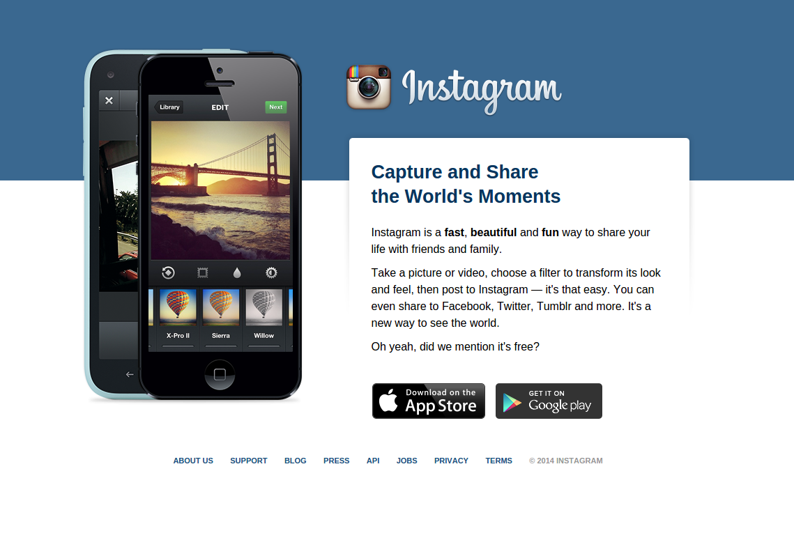

# Instagram Markup

The above image is of the Instagram Website. We are going to make a mock-up of it!

## Part 1 - HTML

**Do not look at the file `index-complete.html` just yet!** Instead, attempt to take the content in [`index.html`](index.html) and give it the necessary HTML framework to apply the styles.

## Part 2 - Styling

The final version we want to create will look like the below:

All of the necessary assets are included in the `/images` folder. Use the version of the HTML in `index-complete.html` if you were unable to create a better version in Part 1!
