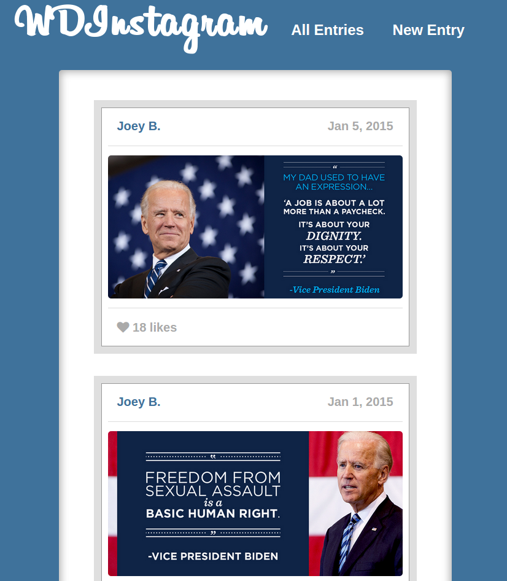
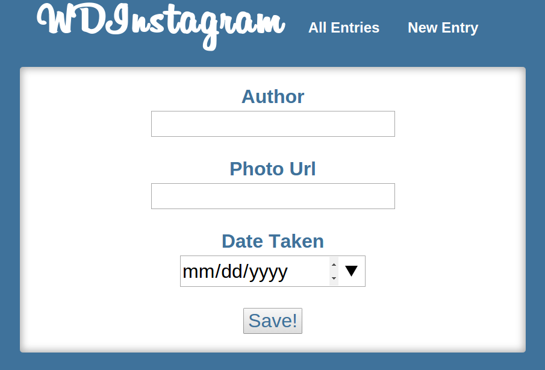
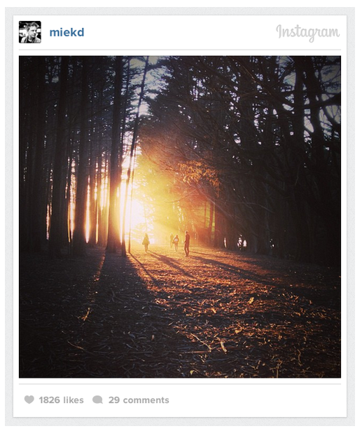

# WDInstagram!

> Here we go, guys, we're making a platform for sharing images!

## Setup

Provided here is a large amount of starter code. There is a Sinatra app, sample
view templates, and assets. You will have to write in route handlers, fill out
the view templates with ERB and any other necessary HTML, and style it!

You may also want to write a **seed file** similar to *CatTinder*'s to have data
in the website as you build and test it.

#### Completion

**Please finish through Part Three.** As always: more is better;
healthy living is best. Only do the bonus if you have completed every single
part.

## Part 1 - HTML Form

Plan and write the necessary form for creating entries. An entry has the
following:

* `author`
* `photo_url` (we aren't uploading photos, just linking to photos online for now)
* `date_taken`

Make sure you can POST the form and handle the request. Use `binding.pry` to
check the params.

## Part 2 - Redis Integration

Write the necessary code, either in a separate handler module or directly in the
Sinatra route handlers, to persist the posted data. Also read from Redis to
display the database's contents in the entries list.

## Part 3 - A Complete App

A complete application should have the following routes, at least:

- `GET /entries`: shows a list of all of the entries (use `index.erb`)
- `GET /entries/:id`: shows a single entry (can use `index.erb` or a `show.erb`)
- `GET /entries/new`: shows the form for a new entry (use `new.erb`)
- `POST /entries`: creates a new entry with the POSTed data, and redirects to
  `GET /entries/:id`

## Part 4 - Style

Make the site look however you want! It's already been set up with some CSS that
can help you to mock Instagram's look & feel, if you like.

We structured our index page (list of entries) to look like this:

Finally, we structured our new page (form) to look like this:

We structured our entries after this image, found online:

### Bonus

1. Add the ability to like, or upvote, the entries by clicking on the heart.
1. Add validation: author and photo_url need to be present, and the date_taken
   should be today by default.
1. Add a `caption` to your entries.
