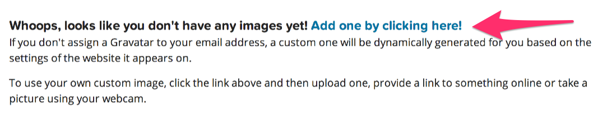
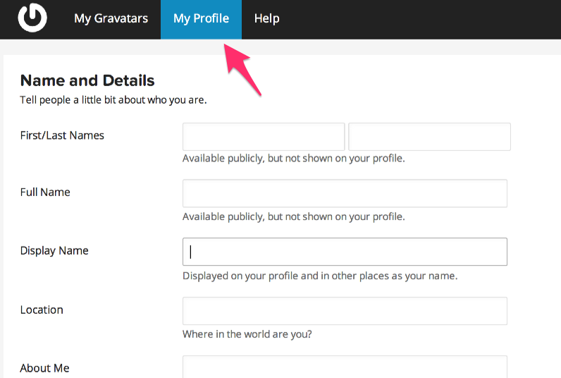
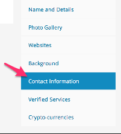

## Getting set up with Gravatar

An "avatar" is an image that represents you online—a little picture that appears next to your name when you interact with websites.

A Gravatar is a Globally Recognized Avatar. You upload it and create your profile just once, and then when you participate in any Gravatar-enabled site, your Gravatar image will automatically follow you there.

Gravatar is a free service for site owners, developers, and users. It is automatically included in every WordPress.com account and is run and supported by Automattic.

Sign up for a profile on [gravatar.com](https://en.gravatar.com/)

Upload an image to your account and be sure to confirm it as your primary photo.

Click on "My Profile" and fill in the form with your information.

Next click on Contact information and add your email. You can add your phone or other contact info if you want.

# Seeding

Ensure your Redis server is running then run `ruby seed.rb` to add your WDI classmate's emails to Redis.

Check it ran properly by running the following from `redis-cli`

`lrange 'wdi:students' 0 -1`

# Displaying

In `server.rb` update the route handler for `get('/students')` 

Read in the student emails from Redis and render them as a list in an erb file called `students.erb`

# Using the Gravatar API

[Check here](https://en.gravatar.com/site/implement/images/) for Gravatar image profile requests.

Write a method to generate an email hash based on the following documentation 

https://en.gravatar.com/site/implement/images/ruby/

# Getting info from the Gravatar Profile API

Get your Gravatar images to show up. Then when you click on an email direct the user to `students/email` and then show the Gravatar profile info.
