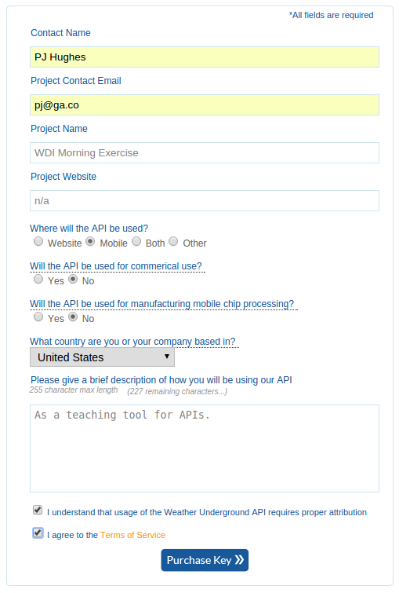

# Weather API


You've been tasked with creating a Ruby program that has among its features the
requirement of retrieving the current weather conditions in any given US city.
For example, your program will be asked to display the weather in
`"New York, NY"`, and should output: `"THE CURRENT TEMPERATURE IS: 12° F"`.

#### Step 1 (10 minutes)

In order to get this information programatically, we will need to access
another web application's API. A good, simple weather API can be found at the
[Weather Underground](http://www.wunderground.com/weather/api/). In order to use
it we will need to register ourselves on their servers.
[Create an account](http://www.wunderground.com/weather/api/d/login.html) with
them and sign up for an API key.

Here is how I filled out the API key form, **after signing up**:



#### Step 2 (10 minutes)

Explore the Weather Underground
[API documentation](http://www.wunderground.com/weather/api/d/docs) to determine
how to structure your query.

#### Step 3 (15 minutes)

Create a `WeatherApiHelper` module, and load it in to `pry` for
testing.

Use `HTTParty` to query the API. Write your helper such that it meets the
specification:

```ruby
require_relative 'weather_api_helper'

include WeatherAPIHelper

temperature("New York, NY")
#=> "THE CURRENT TEMPERATURE IN NEW YORK IS: 12° F"
```

#### Step 4 (15 minutes)

Create a test program that prints out the current weather in:

- New York, NY
- Cleveland, OH
- Wilmington, DE
- Milwaukee, WI
- Honolulu, HA

Print out the cities' temperatures in order from highest to lowest.

#### Step 5 (10 minutes)

Add the hourly forecast to your program. You should have the additional output
look like this:

```
At 08:00 AM it will be 72° F in Honolulu.
At 09:00 AM it will be 73° F in Honolulu.
At 10:00 AM it will be 75° F in Honolulu.
At 11:00 AM it will be 77° F in Honolulu.
At 12:00 PM it will be 79° F in Honolulu.
At 01:00 PM it will be 80° F in Honolulu.
At 02:00 PM it will be 83° F in Honolulu.
At 03:00 PM it will be 85° F in Honolulu.
At 04:00 PM it will be 87° F in Honolulu.
At 05:00 PM it will be 87° F in Honolulu.
At 06:00 PM it will be 87° F in Honolulu.
At 07:00 PM it will be 86° F in Honolulu.
At 08:00 PM it will be 84° F in Honolulu.
At 09:00 PM it will be 82° F in Honolulu.
At 10:00 PM it will be 81° F in Honolulu.
At 11:00 PM it will be 81° F in Honolulu.
At 12:00 AM it will be 80° F in Honolulu.
At 01:00 AM it will be 79° F in Honolulu.
At 02:00 AM it will be 79° F in Honolulu.
At 03:00 AM it will be 79° F in Honolulu.
At 04:00 AM it will be 79° F in Honolulu.
At 05:00 AM it will be 77° F in Honolulu.
At 06:00 AM it will be 77° F in Honolulu.
At 07:00 AM it will be 75° F in Honolulu.
```

#### Step 6 (10 minutes)

Create two methods, `temperature_f` and `temperature_c` that return Fahrenheit
or Celsius, respectively.

Rewrite `temperature` to take an optional second parameter: `"F"` or `"C"`, that
returns either. The default setting is to return in Celsius.
