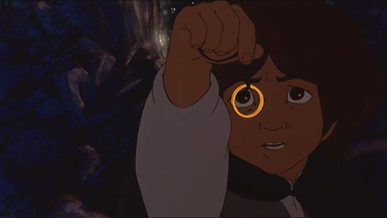

## LOTR Autoplay



We're going to use our newfound knowledge of jQuery and JavaScript Timers to
build a self-governing version of The Lord of the Rings, complete with
soundtrack.

#### Exercise Objectives
- to get reps manipulating the DOM with jQuery
- to get experience making dynamic use of JavaScript timers
- implement event listeners to make your pages more interactive
- practice self-directed learning with a new language

#### Completion

**Please finish through Part 6.** As always: more is better; healthy living is
best. Only do the bonus if you have completed every single part.

#### Setup

Write your functions in `fellowship.js`
Additional data like character and land names are stored in `characters.js`

__Commuters!__ This assignment relies on linking to jQuery via a CDN. If you're without an internet connection, you can link to a local copy of jQuery stored in `scripts`

## 1

```
// An example of using setTimeout to call makeMiddleEarth after 2 seconds.
setTimeout(makeMiddleEarth, 2000)

var makeMiddleEarth = function() {
  // create a section tag with an id of middle-earth
  // create an article tag for each land in the lands array
  // give each article tag a class of "land"
  // inside each article tag include an h1 with the name of the land
  // append each article.land to section#middle-earth
  // append section#middle-earth to the document body
  // use setTimeout to delay the execution of the next function (in this case,
  // makeHobbits) by several seconds
}
```

## 2

```
var makeHobbits = function() {
  // create a ul with an id of "hobbits"
  // create li tags for each hobbit in the hobbits array
  // give each li tag a class of "hobbit"
  // set the text of each li.hobbit to one of the hobbits in the array
  // append the ul#hobbits to the article.land representing "The Shire"
  // (the first article tag on the page)
}
```

## 3

```
var keepItSecretKeepItSafe = function() {
  // create a div with an id of 'the-ring'
  // give div#the-ring a class of 'magic-imbued-jewelry'
  // add an event listener so that when a user clicks on the ring,
  // the nazgulScreech function (provided in index.html) is invoked
  // add div#the-ring as a child element of the li.hobbit representing "Frodo"
  // use setTimeout to delay the execution of the next function
}
```

## 4

```
var makeBuddies = function() {
  // create an aside tag
  // create a ul tag with an id of "buddies" and append it to the aside tag
  // create li tags for each buddy in the "buddies" array
  // give each li tag a class of "buddy" and append them to "ul#buddies"
  // insert the aside tag as a child element of the secion.land representing "Rivendell"
  // use setTimeout to delay the execution of the next function
}
```

## 5

```
var beautifulStranger = function() {
  // find the li.buddy representing "Strider"
  // change the "Strider" textnode to "Aragorn" and make its text green
  // use setTimeout to delay the execution of the next function
}
```

## 6

```
var leaveTheShire = function() {
  // assemble the hobbits and move them to Rivendell
  // use setTimeout to delay the execution of the next function
}
```

## 7

```
var forgeTheFellowShip = function() {
  // create a div with an id of 'the-fellowship' within the section.land for "Rivendell"
  // add each hobbit and buddy one at a time to 'div#the-fellowship'
  // after each character is added make an alert that they have joined your party
  // use setTimeout to delay the execution of the next function by several seconds
}
```

## 8

```
var theBalrog = function() {
  // select the "li.buddy" for 'Gandalf'
  // and change its textNode to 'Gandalf the White'
  // apply style to the element, adding a 3px solid white border to it
  // use setTimeout to delay the execution of the next function
}
```

## 9

```
// Boromir's been killed by the Uruk-hai!
var hornOfGondor = function() {
  // pop up an alert that the Horn of Gondor has been blown
  // put a line-through on Boromir's name
  // and fade Boromir's opacity to 0.3 (he lives on in spirit)
  // use setTimeout to delay the execution of the next function
}
```

## 10

```
var itsDangerousToGoAlone = function(){
  // take Frodo and Sam out of The Fellowship and move them to Mordor
  // add a div with an id of 'mount-doom' to Mordor
  // use setTimeout to delay the execution of the next function
}
```

## 11

```
var weWantsIt = function() {
  // Create a div with an id of 'gollum' and add it to Mordor
  // Remove The Ring from Frodo and give it to Gollum
  // Move Gollum into Mount Doom
  // use setTimeout to delay the execution of the next function
}
```

## 12

```
var thereAndBackAgain = function() {
  // remove Gollum and the Ring from the document
  // Move all the hobbits back to The Shire
  // add the class of "collapse" to Mordor
}
```

#### Bonus

- Within the callback for the click event on '#the-ring",
in addition to calling nazgulScreech,
use jQuery's `fadeOut` and `fadeIn` methods  to make Frodo to fade out,
only to fade in 3 seconds later

- If the ring is clicked 3 times, make Sauron's eye expand in size.
Then after a slight delay, make the entire body element disappear and replaced
with the text "The Ring has been returned to Sauron and the world is over."

- Add a 'Pause' button to the page. Give it an event listener that stops the
execution of the page, regardless of where in the storyline you are.

#### Resources

- [Official jQuery Documentation](http://jquery.com)
- [MDN](https://developer.mozilla.org/en-US/docs/DOM/DOM_Reference)
- [LOTR](http://en.wikipedia.org/wiki/The_Lord_of_the_Rings)
