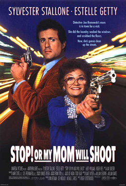

# Stop! Or My Mom Will Shoot

Estelle Getty is TRIGGER HAPPY!

Fire up your Sinatra server on Port 3000 visit localhost:3000

> What?!?!

You'll notice if you move your mouse within the window we'll call `bang` which calls console.log("Bang!");

First, can you change the function `bang` so that it turns the background "RED" for 3 seconds then back to white?

Second, if `bang` is called more than 10 times can you make the background black and add the class "hidden" to the img tag of the movie poster?

Third, rather than changing the styles diretly, refactor the above code to use classes like "shot" and "dead" to make the background red and black.

Fourth, since we can't move our mouse, can you attach event listeners to the window to listen for "keypress"?
Console.log the event.keyCode and see what different numbers are returned. You can use `String.fromCharCode(event.keyCode)` to convert the code back into the keyboard character.

Fifth, if you press C can you append the names in the "cast" object in "cast.js" as li tags in to the "ul#cast" and remove the class "hidden"?

> "cast" is a JavaScript object, not an array. Use JavaScript's "for...in" statement. https://developer.mozilla.org/en-US/docs/Web/JavaScript/Reference/Statements/for...in

Sixth

When you add the cast names to the DOM, attach the class "selected" to the first cast member. Then, can you attach an event listener so that if you press "k" we'll toggle through the list of actors and the "select" class will be removed from the first li and attached to the second and so forth?

Seventh

Have a look at "server.rb" and the route handler "get('/data.json')" Read about "jsonp" and see if you can retrieve the information there and appended it to the DOM when a user presses "r"
