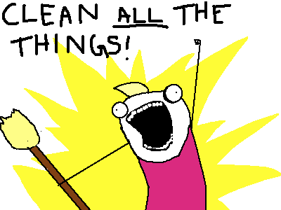

# Firebase Todo App

<a href="http://hyperboleandahalf.blogspot.com/2010/06/this-is-why-ill-never-be-adult.html"></a>

> There's just so much to do! __*__

While you may be familiar with the famous *"Hello World!"* program that is used
to model the simplest introduction to a language, now we're going to step in
to the world of the **[Todo Application][todo-app-list]**.

Todo apps have become the canonical first application to write when building 
client-side applications. For a list of examples, you can visit 
[TodoMVC][todo-mvc]!

#### Completion

**Please complete through Part 5.** Part 6 is very important, but there is a lot
going on here and you may not finish it. Part 7 is cool!

- [x] Read the introduction!
- [ ] Part 1: Model the data from a wireframe.
- [ ] Part 2: Write utility functions to perform actions.
- [ ] Part 3: Connect the model to Firebase for persistence.
- [ ] Part 4: Build the Todo App DOM manipulations with jQuery.
- [ ] Part 5: Integrate DOM and model interactions.
- [ ] Part 6: Use a Firebase listener to update the DOM.
- [ ] Part 7: Also listen to Firebase for updates and removals.
- [ ] Part 8: Refactor code and remove global namespace pollution.

> Let's check some things off of our list!

## Part 1: Todo Model

The **Todo App** will be composed of a list of **tasks** to accomplish. It
should look something like this:


<caption>Click the image to see the full version.</caption><br>

We can create tasks, decide that they are complete, and finally remove them.

> If this is a general idea of how we want our application to look, what data
> can we infer we will need? What structure should hold our data?

- [ ] 1. Create an object to hold our application's data.
- [ ] 2. Enter into the object the data represented in the image above.

## Part 2: Functionality

Now that you've created a model, we need to interact with that model. Write
functions to ensure that we can make our model work as it should.

> Here is an important rule about developing client-side applications:
>
> ***Always make your logic work in the console before doing anything with
> either the DOM or a server.***

The actions we need to implement in our model are:

- [ ] 1. Create a new task (`createTask`). Make sure to give the new task a
         unique ID! Also, have the function return that new unique ID. (Remember
         how we did this with Redis?)
- [ ] 2. Mark a task as complete or as incomplete (`toggleComplete`), given the
         task's unique ID.
- [ ] 3. Remove a task (`removeTask`).
- [ ] 4. List tasks (`listTasks`). This should *log to the console*!

## Part 3: Firebase as a Model

*Remember: a big help for this part will be the 
[Firebase Quickstart Guide][firebase-guide] and the
[Firebase API Docs][firebase-api].*

Let's replace our local model (a JavaScript object) with a reference to a
persistent store on Firebase! Keep the Firebase open in the browser while
testing the console functions to see that they work.

- [ ] 1. Create a Firebase with the name TodoApp (and pick a url that is 
         available) on the [Firebase website][firebase-website].
- [ ] 2. Rewrite `createTask` so that it creates a task on Firebase, using 
         `Firebase#push`. Make sure that you return the unique ID!
- [ ] 3. Rewrite `toggleComplete` to work with Firebase using `Firebase#child`
         to get the child reference, and `Firebase#set` to change its value.
         *For now you can have it just force `complete` to be `false`.*
- [ ] 4. Rewrite `removeTask` to work with Firebase using `Firebase#child` and
         `Firebase#remove()`.

## Part 4: DOM Manipulation

Now we have to add DOM manipulation. As an example for the rest of the project,
here is **[a working version of the app][example]**.

First, we create utility functions:

- [ ] 1. Write a function to create a new HTML "task" element! Use the HTML
         provided below as an example (`createTaskEl`). This function should 
         take a description and completion status (`true`/`false`) as arguments,
         and return a new task `<div>`. Warning: set the checkbox status with
         the `jQuery#prop` method. It's a [tricky thing][jquery-prop]!
- [ ] 2. Write a function to add a task element to the DOM (`addTaskEl`)! It
         should take all the same inputs as `createTaskEl`, call `createTaskEl`
         and save its result, and then add it to the "task-list" on the DOM.

Test your functions by calling them in the console and seeing the changes in the
DOM! Your tasks' HTML should be structured like:

```html
<div class="task">
  <input type="checkbox">
  <span class="task-description">Task description here.</span>
  <span class="remove">X</span>
</div>
```

Next we have to add the functions to toggle completeness or remove the element!
The problem with that is, how do we know what our task is? For example, when I
say "Remove that task from the page!", which task do I mean?

The solution is to add extra *metadata* to our task element (`<div>`) with the
task's unique ID. Therefore we can reference a task directly from it's element.

- [ ] 3. Rewrite `createTaskEl` (and `addTaskEl`) to take a unique ID as well.
         Add the unique ID to the element as a "[data attribute][data-attr]". 
         You can do this very simply with
         [jQuery's `jQuery#attr` method][jquery-attr]
         (`.attr("data-...", "value")`)! __**__

The completed `<div>` should look like:

```html
<div class="task" data-taskid="-JgsdJOeEO_QARoiOB3c">...</div>
```

Finally, we write the toggle completeness and remove element functions:

- [ ] 4. Toggle the class "complete" on the task element (`<div>`). You can
         grab the correct element by finding the
         [right data attribute][find-by-attr] (`toggleTaskElComplete`).
- [ ] 5. Remove the element based on the task ID (`removeTaskEl`).

## Part 5: Integrate the Model and the DOM with Interaction

Next, we need to make the DOM interactive! This means *event-driven UI*.

- [ ] 1. Let's write a function `newTask` that:
  1. takes as arguments:
    - the task's unique ID,
    - the description,
    - the completed status (`true`/`false`),
  1. creates and adds the new task as an element, and finally
  1. adds listeners to the element for the remove and complete events,
     which is easier with the [jQuery#on][jquery-on] method, passing a
     child selector to it; for example:
     `taskEl.on("click", ".remove", killTask);`
- [ ] 2. Now, we need to add a *click* event handler to the "new-task" form's
         `submit` event that:
  1. stops the form's submission,
  1. gets the description from the input,
  1. creates the new task in the model (saving the ID for the next step),
  1. and adds the new task to the DOM (calls `newTask`).
  1. Note: make sure that this listener is added *after the DOM content
    is loaded*!

Awesome! Phew. Still with us? :)

- [ ] 3. Add event functions remove (`killTask`) and complete (`completeTask`), 
         and attach them to the event listeners from 1.iii above. Each of these
         will grab the task ID of the element where the event is fired, and
         use that to call the model and DOM functions created above.
  - Note: use the event `change` on the checkbox, not `click`.
- [ ] 4. Rewrite `toggleComplete` to actually toggle the complete status, by
         dynamically setting the completed status based on what it currently
         is in the DOM.
  - Note: you can check the status of the task with `jQuery#hasClass`.

## Part 6: Listen to Firebase and Update the DOM

- [ ] 1. Add a listener for `child_added` events to your Firebase with 
         `Firebase#on`. The listener should be sure to add the element to the 
         page (`newTask`).
- [ ] 2. Remove the call to `newTask` from the "new-task" form submission event
         listener. As long as we update the model (Firebase) itself, the 
         Firebase listener will trigger.

## Part 7: Listen for Updates and Removals

For this part, open a second browser window to your page. Make sure that when
you change one, the other synchronizes!

- [ ] 1. Create stubs for the necessary event callbacks for update and remove 
         (`child_changed`, `child_removed`) that just log to the console to be 
         sure they are even firing!
- [ ] 2. Rewrite `killTask` and `completeTask` so that the creation of the DOM 
         elements takes place in above event listeners instead.
- [ ] 3. To make the checkboxes synch up properly, rewrite the 
         `toggleTaskElComplete` function to take an optional complete status
         argument. In the function, if that argument is not undefined, use it to
         set the checkbox status with `jQuery#prop`! Make sure that the 
         `child_changed` event passes it a complete status.

## Part 8

Finally, add all of your currently global variables as properties of a
single global object, `todoApp`. Remove the previous variables from your code.
Ask if you want an example. When you do this, you:

- [ ] 1. Clean up your global namespace pollution!

Also, refactor your code and comment it to make it readable.

## Bonus

1. Style it to your heart's content!
1. Add the ability to create multiple lists... Good luck!

---

*&#42; - Note: I also found [this image](http://media4.popsugar-assets.com/files/2012/05/18/5/192/1922507/e4c039a311783f5a_tumblr_lvyeogOsYP1r83s2so1_500.jpg), which I love. Good job, internet.*

*&#42;&#42; - You may also use [jQuery's `jQuery#data` method][jquery-data] to
set data attributes, but those data attributes are not visible in Chrome's
console, making it harder to test.*

<!-- Links -->

[todo-app-list]:    http://www.forbes.com/sites/allbusiness/2013/12/04/the-9-best-to-do-list-apps-for-2014
[todo-mvc]:         http://todomvc.com
[data-attr]:        https://developer.mozilla.org/en-US/docs/Web/Guide/HTML/Using_data_attributes
[firebase-website]: https://www.firebase.com/account/#/
[firebase-guide]:   https://www.firebase.com/docs/web/guide
[firebase-api]:     https://www.firebase.com/docs/web/api
[jquery-attr]:      http://api.jquery.com/attr
[jquery-data]:      http://api.jquery.com/data
[jquery-on]:        http://api.jquery.com/on
[jquery-prop]:      http://api.jquery.com/prop
[find-by-attr]:     http://stackoverflow.com/questions/2487747/selecting-element-by-data-attribute
[example]:          http://h4w5.github.io/example_firebase_todo
