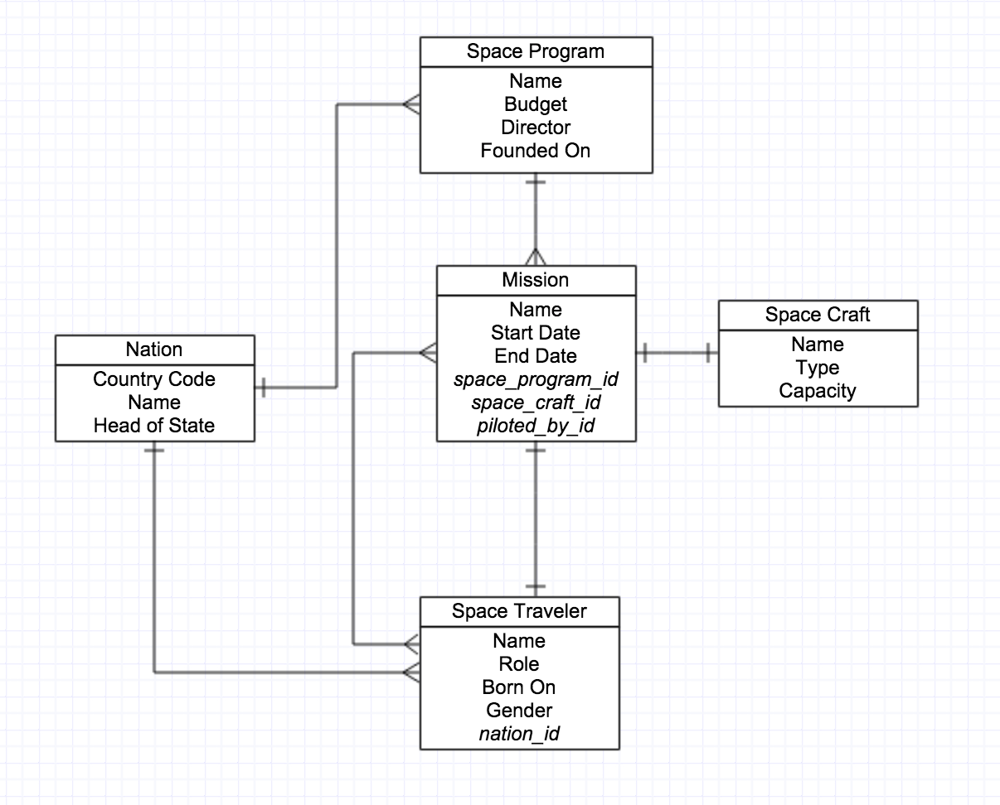

# Modeling for Fun and Profit


## Setup

This assignment asks you to practice creating, filling and envisioning data in
our applications. In specific, we are going to be creating databases for a
number of Phil's pet projects.

### Completion

Please complete through Part 3!

## Part 1 - Write the Schema

Create a schema for the following ERD, which describes an International Space
Program Database for huge space nerds like Phil.



> Did you know: Phil went to Space Camp as a child?

## Part 2 - Draw the ERD

Given the below schema, draw an ERD. *When you are finished, you can consult the
included ERD file `images/part_two_erd.png` to make sure you have done it
correctly.* The database is a pill tracker for Phil's family. You may not know
it, but they suffer from heart disease, credulous beliefs in suspect natural
supplements, and hypochondria!

**Database:** `family_pill_tracker_db`

```sql
DROP TABLE IF EXISTS maladies_persons;
DROP TABLE IF EXISTS maladies_pills;
DROP TABLE IF EXISTS pill_schedules_pills;
DROP TABLE IF EXISTS pill_schedules;
DROP TABLE IF EXISTS persons;
DROP TABLE IF EXISTS maladies;
DROP TABLE IF EXISTS pills;
DROP TYPE  IF EXISTS day_names;

CREATE TABLE persons (
  id      SERIAL      PRIMARY KEY,
  name    VARCHAR(50) NOT NULL,
  born_on DATE
);
CREATE TABLE maladies (
  id       SERIAL      PRIMARY KEY,
  name     VARCHAR(50) NOT NULL,
  symptoms TEXT[],
  is_real  BOOLEAN     DEFAULT FALSE
);
CREATE TABLE pills (
  id           SERIAL      PRIMARY KEY,
  name         VARCHAR(50) NOT NULL,
  side_effects TEXT,
  dosage       VARCHAR(50) DEFAULT '50mg',
  is_fda_approved BOOLEAN  DEFAULT FALSE
);
CREATE TYPE day_names AS ENUM ('Mon','Tue','Wed','Thu','Fri','Sat','Sun');
CREATE TABLE pill_schedules (
  id          SERIAL    PRIMARY KEY,
  quantity    INTEGER   DEFAULT 1,
  day_of_week day_names DEFAULT 'Sun',
  person_id   INTEGER   REFERENCES persons,
  pill_id     INTEGER   REFERENCES pills
);
CREATE TABLE maladies_persons (
  malady_id INTEGER REFERENCES maladies,
  person_id INTEGER REFERENCES persons
);
CREATE TABLE maladies_pills (
  malady_id INTEGER REFERENCES maladies,
  pill_id   INTEGER REFERENCES pills
);
CREATE TABLE pill_schedules_pills (
  pill_id          INTEGER REFERENCES pills,
  pill_schedule_id INTEGER REFERENCES pill_schedules
);
```

> "Eat the pizza, Phil, *it won't kill you.* I don't care if you've had your
> Lactaid or not!" — Phil's Mom

## Part 3 - Model Domains

For each of the following, read the description of the domain, and then model it
into an ERD with entities and relationships. Draw the ERD diagram.

#### A. Fridge Managment App

Phil's family needs help managing their refridgerator. The app should allow you
to keep inventory of all the food in a fridge, organize it, throw out food
that's gone spoiled, etc. It should also suggest meals based on foods that are
near spoilage.

#### B. Manga Library

Phil has an extensive library of obscure manga, and he's not afraid to share it!
Help him create an app that tracks who has his manga, what's on hand, and
information to find new and interesting types. Also, by contributing to the
library, or being a frequent borrower of manga for short periods of time, you
can earn new titles, like "Manga Maniac" and "True Otaku".

#### C. Street Pets App

Phil has a deep love of street animals, and feels a bizarre obligation to help
them get back on their *paws* again. Help him create an app to manage his
network of "Pet Patrol People" on the street: identifying animals that have
been found and where, what ailments they have, and who currently can house them
and nurse them back to health. Also, there should be a list of shelters to
bring the animals to if all the pet patroller's houses are overflowing with
love!

## Part 4 - Database Creation

From your ERD diagrams above, write a database schema files:

A. Database: `refridgerator_management_db`, Schema: `create_fridge_db.sql`   
B. Database: `manga_library_db`, Schema: `create_library_db.sql`   
C. Database: `street_pets_db`, Schema: `create_pets_db.sql`   

