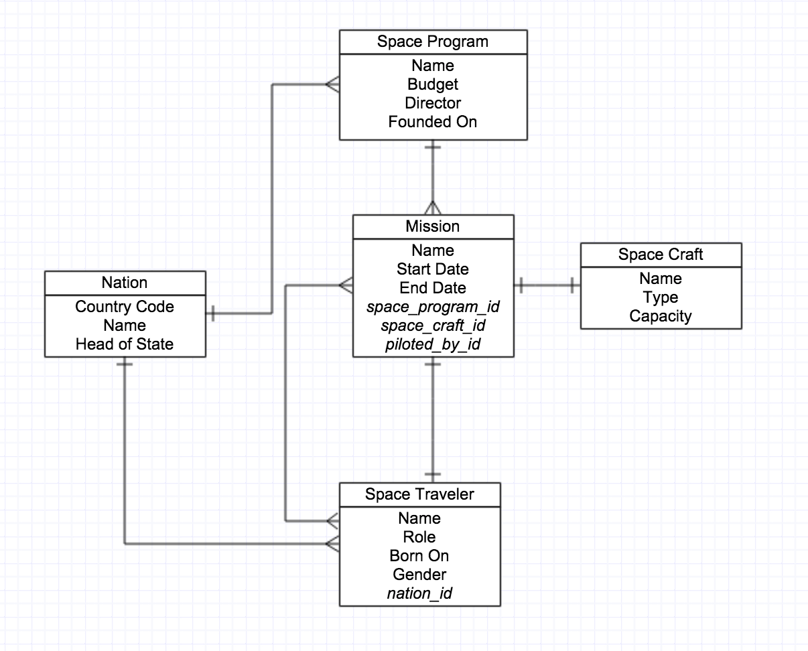

# DataSpace™


> Not since the failure of Lou Dobbs's
> [Space.com](http://en.wikipedia.org/wiki/Space.com) has there been a project
> more important for spurring the popular imagination of the next generation
> towards science and exploration than Phillip Lamplugh's *DataSpace*. Bless
> this man: a saint, a scholar, a hero, a *spaceman*.

— Neil deGrasse "Junior High" Tyson, last night on TV in the dream Phil had...

Tonight we will take a database and wrap it with ActiveRecord, so that we can
super-power our CRUDing and take it to the next level!

## Setup

Make sure that you have a PostgreSQL database named `data_space_db`. You can do
this easily by running (from the command line):

```bash
$ createdb data_space_db
```

Then create the schema by running the SQL file provided,
`create_data_space.sql`.

```bash
$ psql -d data_space_db -f create_data_space.sql
```

When you're done, you should now have this database set up and running:



### Completion

**Please finish through Part 2.** That's the whole thing! As always:
while more is better; healthy living is best.

## Part 1 - Create ActiveRecord Classes (Models)

1. Add to the folder `models` a file for each of the tables for the
   DataSpace DB. Have that file create the class and inherit from ActiveRecord.
  > Which tables need models? Which don't?

1. Add validations to the models where necessary to enforce the constraints
   described in our schema, including:
     - ["ENUM"s](http://guides.rubyonrails.org/active_record_validations.html#inclusion)
     - [NOT NULLs](http://guides.rubyonrails.org/active_record_validations.html#presence)
     - any others you find necessary (but don't go overboard!)

**TEST YOUR MODELS AND VALIDATIONS AS YOU GO.** Run them in `pry` to ensure
that they work, loading them one-by-one thru the `data_config.rb` file.

## Part 2 - Relate the Models!

Begin implementing the relationships, known in ActiveRecord as
[associations](http://guides.rubyonrails.org/association_basics.html), between
the models. Remember, each of these relationships is bi-directional:

1. *Space Program* and *Nation*,
1. *Space Traveler* and *Nation*,
1. *Mission* and *Space Craft*,
1. *Mission* and *Space Traveler* (general), and
1. [*Mission* and *Space Traveler* ("piloted_by")](http://www.spacevatican.org/2008/5/6/creating-multiple-associations-with-the-same-table)

**TEST YOUR ASSOCIATIONS AS YOU GO.** Run them in `pry` to ensure that they
work. If you just write them you will fail.

## Part 3 - Add Logic and Functionality

Add the following methods to your models to make them even more useful!

1. Space Traveler
  - `SpaceTraveler#age` → the traveler's age as an integer
  - `SpaceTraveler#full_name` → the traveler's name and role, preceded by the
    the term 'Astronaut' (default), 'Spationaut' (French) or 'Cosmonaut'
    (Russian) based on their nation of origin
1. Mission
  - `Mission#ongoing?` → a predicate method to tell if a mission is active today
1. Nation
  - `Nation.thanks` → a class method that prints out a thank you to all of the
    space travelers that have moved it in to the future!
