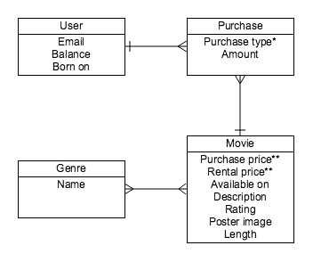

:q


Popcorn.biz is the #7 digital destination for renting and purchasing movies owned by the Estate of late funk icon, movie buff and media mogul, James Brown.

We've been tasked with building out their database given the following ERD and specifications.

## The ERD



__*__ – the attribute "type" is reserved in ActiveRecord, so don't use 
*just* "type"   
__**__ – remember not to use floats for money, since float arithmetic is
imprecise...

## Set Up

Create a database called `popcorn_db`.

Define your schema in `db/schema.sql`.

Write all your ActiveRecord `models` in the `models` folder.

Use `require_relative` to add each `model` to `db/config.rb`.

#### Simple Testing Your Schema and Models

You can add a `db/seeds.sql` file, like you've seen already, that seeds the
database with test values. You can also put them right in to `psql`.

However, another way to to quickly create dummy data is to use the 
[Faker Gem][ffaker] in a `db/seeds.rb` file.

Example Usage:

```ruby
require 'ffaker'
require 'pg'

pg_conn = PG.connect(dbname: 'popcorn_db')

10.times do
  name  = Faker::Name.name
  #=> "Miss Pearlie Buckridge", eg
  email = Faker::Internet.email
  #=> "grayce@ledner.ca", eg
  born  = Faker::Time.date(:year_range => 60, :year_latest => 11)
  #=> "1976-04-09 00:00:00 -0500", eg

  pg_conn.exec_params("INSERT INTO users (name, email, born_on) VALUES ($1, $2, $3)", [name, email, born])
end

Faker::Movie.title
#=> "Man 2: Electric Boogaloo"

# ... etc
```

This works before you even know if your ActiveRecord models work! Once you
are sure they are working, however, you can refactor this code to look like:

```ruby
require 'ffaker'
require_relative 'config.rb' # loads ActiveRecord

10.times do
  User.create(
    :name    => Faker::Name.name
    :email   => Faker::Internet.email
    :born_on => Faker::Time.date(:year_range => 60, :year_latest => 11)
  )
end

# ... etc
```

> To find out what else Faker can generate, **poke around in `pry`.**

Populate your database with some test data by updating and running the
`db/seeds.rb` file.

#### Completion

Get as far as you can!

---

## Models

Make your models one at a time, testing them as you go. For each one:

1. create the table schema;
1. add at least one piece of data to the table via a SQL `INSERT` 
   statement to ensure it works (in the schema file or in psql);
1. create the ActiveRecord model, and test to make sure it works;
1. add any ActiveRecord validations that you deam necessary;
1. add any ActiveRecord associations for this model (once both related
   models exist), and test them all (in each direction);
1. (**Bonus**) finally, add any extra logic as methods to the model .

### Genre

A `Genre` should have the following attributes
- a name (ie "Action", "Adventure", "Sci-Fi")

A `Genre` should have the following associations
- A Genre has and belongs to many movies

### Movie

A `Movie` has the following attributes:

- an id as its primary key
- a purchase price which should default to 14.99
- a rental price which should default to 3.99
- a released_on date
- a description of the film
- a rating between G and NC-17
- an image URL for a poster
- the running time of the film in minutes
- a created_at timestamp
- an updated_at timestamp

A `Movie` should have the following associations:

- A movie may have many purchases
- A movie has and belongs to many genres

A `Movie` should have the following instance methods:

- `available?` which returns true or false based on if the released_on date has passed
- `formatted_time` which returns the time formatted as "N hours and N minutes"
- `rented_by?(user)` which takes a user object and returns true or false if the person rented it.
- `owned_by?(user)` which takes a user object and returns true or false if the person owns it.

### User

A `User` has the following attributes:

- an id as its primary key
- an email which is unique and can't be null
- a balance which should default to 0
- a born_on date
- a created_at timestamp
- an updated_at timestamp

A `User` should have the following associations:

- A User may have many Purchases
- A User has Movies [through](has_many_thru) Purchases

A `User` should have the following instance methods:

- `age` which should return an integer of their age in years
- `can_afford_to_buy?(movie)` which takes a movie object as a paramter and returns true or false based on if they have enough money to buy that movie
- `can_afford_to_rent?(movie)` which takes a movie object as a parameter and returns true or false based on if they have enough money to rent a movie
- `can_view?(movie)` which takes a movie object as a parameter and returns true or false based on if they are of an appropriate age based on the movie's rating.
- `buy(movie)` checks that the movie can be purchased then either creates a new Purchase for that User and deducts the purchase price or returns false. If the user already owns the movie, a new purchase is __not__  created and the method returns false.
- `rent(movie)` checks that the user can rent the movie then either creates a new Purchase for that User and deducts the rental price or returns false
- `rented_movies` returns only movies that the User has rented
- `purchased_movies` returns the movies that the User has purchased
- `owns?(movie)` takes a movie object and returns true or false based on whether the user owns it.

### Purchase

A `Purchase` has the following attributes:

- an id as its primary key
- a user_id of the user making the purchase
- a movie_id of the movie being purchased
- whether the purchase was to own or rent
- a created_at timestamp
- an updated_at timestamp

A `Purchase` should have the following associations:

- A Purchase belongs to a User
- A Purchase belongs to a Movie

## Advanced Testing Your Model Logic (Instance Methods)

**In order to test that all your instance methods are working properly**, think 
about what data you'd need in your database.

For instance, if a user can only purchase a movie if they have enough money, 
you may want to have at least two users, one with enough money and one without 
enough money so that you can test both scenarios.

Work with a partner to come up with some example scenarios to test out your ActiveRecord models and their instance methods.

Save each scenario as a Ruby file in a "features" folder.

Example Scenario

```ruby
# underage_purchases.rb
# A 13 year old user with a balance of $50 tries to rent a Rated-R movie.

teenager = User.new({email: "laxbro@gmail.com", born_on: "1/27/02", balance: 50})
rated_r_movie = Movie.find_by({rating: "R"})
teenager.can_view?(movie)        #=> should return false
teenager.rent(movie)             #=> should return false
teenager.rentals.include?(movie) #=> should return false
```

<!-- Links -->
[has_many_thru]: http://guides.rubyonrails.org/association_basics.html#the-has-many-through-association
[ffaker]: https://github.com/EmmanuelOga/ffaker
