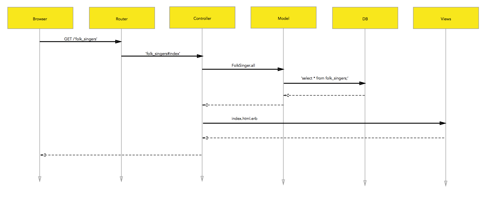

## Vocab

- **MVC** - an architectural pattern for implementing user interfaces
- **REST** - Representational state transfer an architectural pattern
- **RESTful** - web services that adhere to REST with standard HTTP verbs performed on resources
- **resource** - data endpoints
- **route** - decides which controller receives which requests
- **controller** - receives specific requests for the application
- **action** - collects information to provide to a view
- **view** - display information in a human readable format
- **model** - the data, logic and rules
- **helper** - utility methods
- **rake** - a program to run tasks
- **migration** - a way to alter your database over time

Request -> Route -> Controller -> Action -> Model -> View -> Response

## Important files and folders

- `config/routes.rb`
- `config/database.yml`
- `app/controllers`
- `app/models`
- `app/views`
- `db/seeds.rb`
- `assets/javascripts`
- `assets/stylesheets`
- `assets/images`

## Transitioning from Sinatra Route Handlers

Sinatra route handler

```rb
# app.rb
get('/movies') do
    @movies = Movie.all
    render(:erb, :movies, layout: :default)
end
```

Rails route and controller

```rb
# config/routes.rb
Rails.application.routes.draw do
    get 'movies' => 'movies#index'
end
```

```rb
# app/controllers/movies_controller.rb
class MoviesController < ApplicationController
    def index
        @movies = Movie.all
        render(:index)
    end
end
```

## Rail's Request/Reponse Cycle

The request/response cycle in Rails to access a resource as a collection



## Draw out the Request Response cycle for the following resource

Using the above as a guide, how would you diagram the following 7 routes

| HTTP Verb | Path             | Controller#Action   | Used for
| :--       | :--              | :--                 | :--
| GET       | /photos          | photos#index        | display a list of all photos
| GET       | /photos/new      | photos#new          | return an HTML form for creating a new photo 
| POST      | /photos          | photos#create       | create a new photo
| GET       | /photos/:id      | photos#show         | display a specific photo
| GET       | /photos/:id/edit | photos#edit         | return an HTML form for editing a photo
| PATCH/PUT | /photos/:id      | photos#update       | update a specific photo
| DELETE    | /photos/:id      | photos#destroy      | delete a specific photo

>  By default, controllers in Rails automatically render views with names that
>  correspond to valid routes.

> Any verb other than GET should redirect. Where should that happen?

### Conventions

The naming convention of controllers in Rails favors pluralization of the last
word in the controller's name

**Rails Naming Conventions**

| Type        | Convention | Example
| :--         | :--        | :--
| Model       | Singular   | Coffee
| Controller  | Plural     | Coffees
| View        | N/A        | app/views/coffees/index.html.erb – controller(plural)/action(singular)
| Table       | Plural     | SELECT * FROM `users`;
| Resource    | Plural*    | :coffees

Additional Conventions

- Each controller action maps to particular CRUD operation in a database.
- Controllers in Rails favor pluralization of the last word in the controller's
name. Controllers in Rails automatically render views with names that correspond
to valid routes. 
- If you do not explicitly render something at the end of a
controller action, Rails will automatically look for the action_name.html.erb
template in the controller's view path and render it. 
- To find the current layout, Rails first looks for a file in app/views/layouts 
with the same base name as the controller. For example, rendering actions from 
the PhotosController class will use app/views/layouts/photos.html.erb (or
app/views/layouts/photos.builder). If there is no such controller-specific
layout, Rails will use app/views/layouts/application.html.erb

## Useful Commands 

`rake routes`
`rake -T`
`rake db:create`
`rake db:rollback`
`rake db:schema:dump`
`rake notes`
`rails g migration`
`rails g migration what_it_does`
`rails s`
`rails c`

Resources 

- http://guides.rubyonrails.org/routing.html
- http://guides.rubyonrails.org/action_controller_overview.html
- http://guides.rubyonrails.org/layouts_and_rendering.html
- http://guides.rubyonrails.org/security.html
