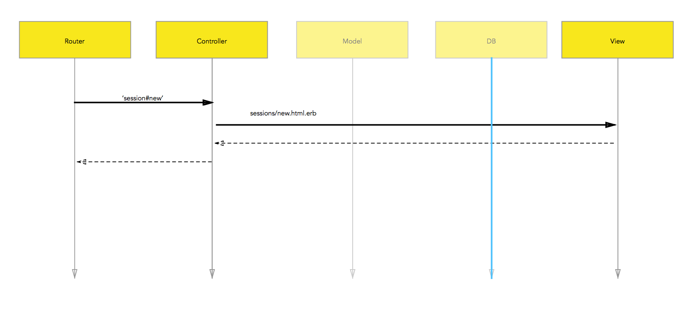
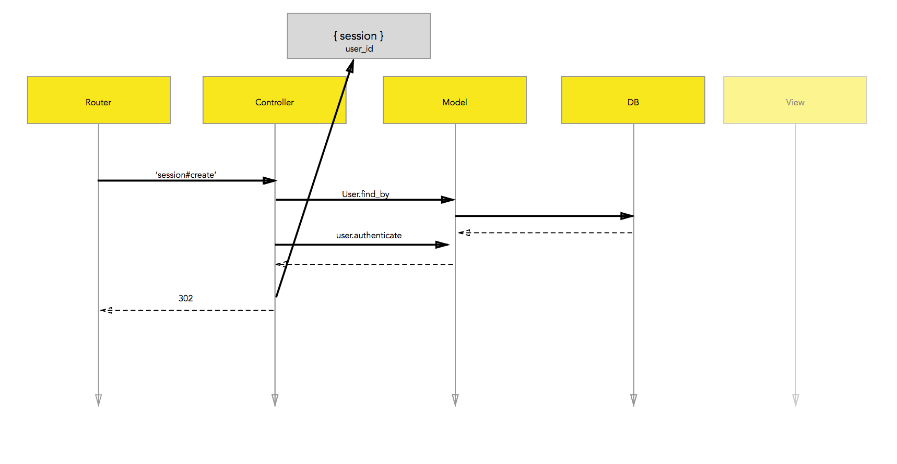
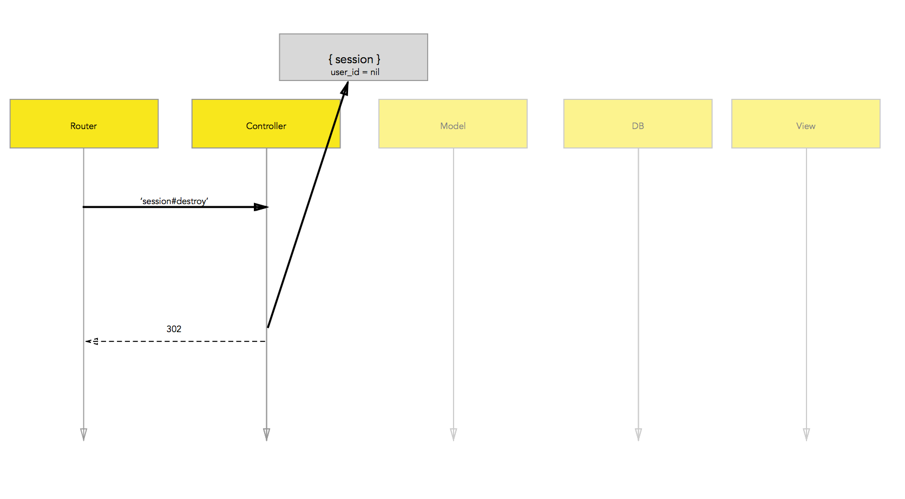

## Setup

To authenticate users we'll uncomment bcrypt from the Gemfile

```rb
# Gemfile
# Use ActiveModel has_secure_password
gem 'bcrypt', '~> 3.1.7'
```

Our users table will require a "password_digest" column

```rb
# db/migrate/TIMESTAMP_create_users.rb
class CreateUsers < ActiveRecord::Migration
  def change
    create_table :users do |t|
      t.string :email
      t.string :password_digest # bcrypt stores a digest not the password
      t.timestamps null: false
    end
  end
end
```

Our user model will have has_secure_password
```rb
# app/models/user.rb
# create_table "users", force: :cascade do |t|
#   t.string   "email"
#   t.datetime "created_at",      null: false
#   t.datetime "updated_at",      null: false
#   t.string   "password_digest"
# end

class User < ActiveRecord::Base
  # we get this method from bcrypt
  # and need to create a password_digest column
  has_secure_password
end
```

## Rendering the Login Form

```rb
# config/routes.rb
# Setup our three routes for handling sessions
  get    '/login' => 'sessions#new'
```

The login form isn't for a resource, just an email and password.

```erb
<!-- views/sessions/new.html.erb -->
  <h1>Login</h1>
  <%= form_tag '/login' do %>
    <%= text_field_tag :email %>
    <%= text_field_tag :password %>
  <% end %>
```

```rb
# app/controllers/sessions_controller.rb
class SessionsController < ApplicationController
  def new
    # render the login form
  end
```



## Handling Session Create and Storing the User id


```rb
# config/routes.rb
post   '/login' => 'sessions#create'
```

```rb
# app/controllers/sessions_controller.rb
class SessionsController < ApplicationController
  # ...
  def create
    user = User.find_by({email: params[:email]})
    # if we found a user with that email
    # and they provided the correct password
    # we get `authenticate` from adding bcrypt
    if user && user.authenticate(params[:password])
      # store their id in session
      session[:user_id] = user.id
      redirect_to user_path(user)
    else
      # rerender the form
      render :new
    end
  end
  # ...
end
```

## Deleting a Session and Logging Out


```rb
# config/routes.rb
delete '/logout' => 'sessions#destroy'
```

```rb
# app/controllers/sessions_controller.rb
class SessionsController < ApplicationController
  # ...
  def destroy
    # remove the user_id from session
    session[:user_id] = nil
    redirect_to '/login'
  end
  # ...
end
```
